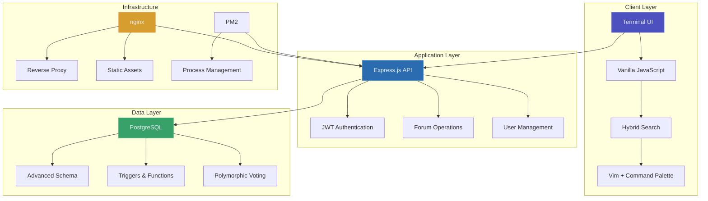
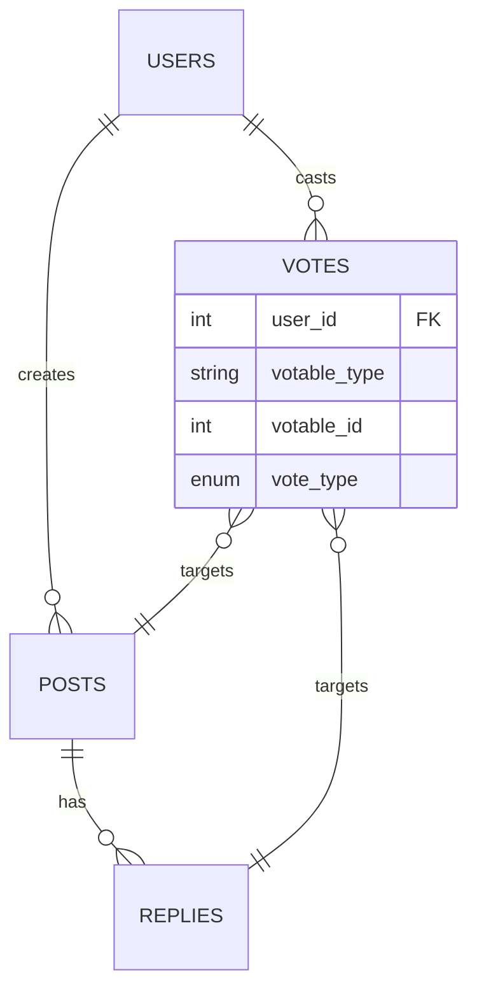
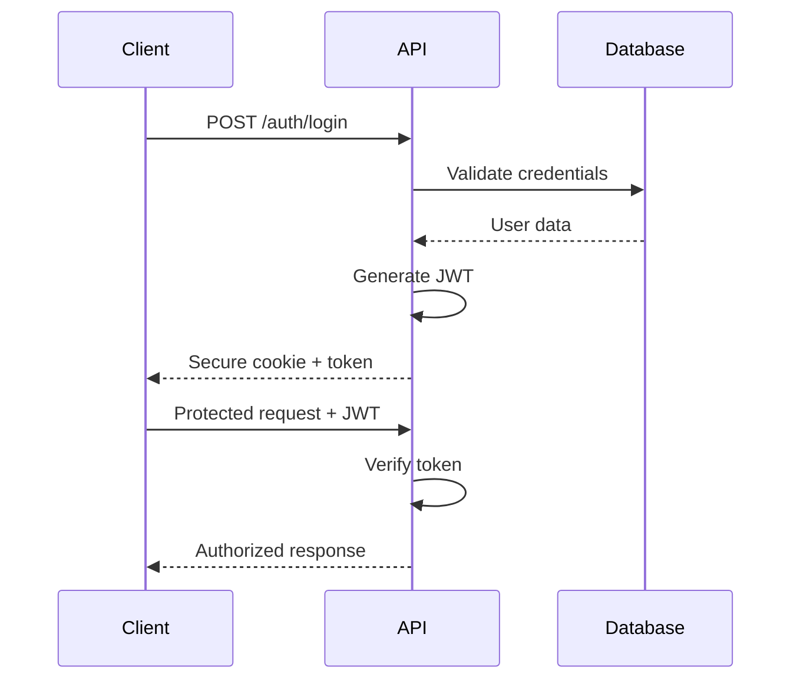

# Architecture Documentation

> System design and technical decisions for ARCFORGE terminal forum platform

**Tags:** #architecture #system-design #documentation

## 🚀 Quick Navigation

- **[System Overview](system-overview.md)** - Complete architecture with Mermaid diagrams
- **[Database Schema](database.md)** - PostgreSQL design with triggers and constraints  
- **[Decision Records](adr/)** - Why we made key technical choices

## 🏗️ Architecture Overview

ARCFORGE is a production-grade forum platform with terminal-inspired UI, demonstrating enterprise patterns in a solo-developed application.

## 🎯 Key Architectural Highlights

### **Production-Grade Features**
- **Advanced Database Design**: PostgreSQL with triggers, UPSERT operations, polymorphic relations
- **Enterprise Authentication**: JWT + bcrypt with role-based access control
- **Scalable Infrastructure**: nginx + PM2 + VPS deployment
- **Real-time Voting**: Optimistic updates with database consistency

### **Terminal-Inspired UX**
- **Fortress Navigation**: File-tree metaphor with collapsible folders
- **Keyboard-First**: Full functionality via shortcuts (`j/k`, `/`, `Ctrl+K`)
- **Progressive Enhancement**: Works without JavaScript, enhanced with it

### **Performance Optimizations**
- **Denormalized Counters**: Vote counts cached for fast queries
- **Strategic Indexing**: Optimized for common forum access patterns
- **Root-relative Assets**: Migration-proof CSS/JS loading

## 📊 System Complexity

### **Database Sophistication**

- **Polymorphic Voting**: Single table handles post AND reply votes
- **Database Triggers**: Auto-update counts on vote changes
- **Referential Integrity**: Cascade deletes maintain consistency

### **Authentication Flow**

## 🔧 Technology Stack Rationale

### **Why Vanilla JavaScript?**
- **No build tools** - Deploy anywhere instantly
- **Performance** - No framework overhead
- **Learning** - Deep understanding of web fundamentals
- **Maintainability** - No dependency hell

### **Why PostgreSQL?**
- **Advanced features** - Triggers, functions, complex queries
- **ACID compliance** - Data integrity for forum operations
- **Scalability** - Production-ready with read replicas
- **Developer experience** - Rich SQL ecosystem

### **Why Express.js?**
- **Minimal overhead** - Fast API responses
- **Ecosystem maturity** - Battle-tested middleware
- **Flexibility** - Not opinionated about structure
- **JWT integration** - Clean authentication patterns

## 📈 Portfolio Demonstration

This architecture showcases:

- **Systems thinking** - Understanding of full-stack concerns
- **Database expertise** - Advanced PostgreSQL features
- **Security awareness** - Proper authentication and authorization
- **Performance consciousness** - Caching, indexing, denormalization
- **Operational knowledge** - Production deployment and monitoring

See individual documentation sections for detailed technical analysis.

---

*Built by a solo developer to demonstrate enterprise-level architecture patterns and production deployment capabilities.*