# System Architecture

## Overview
ARCFORGE is a terminal-inspired web platform built around the metaphor of navigating a digital fortress. The architecture supports modular expansion while maintaining consistent terminal aesthetics.

## System Architecture

```mermaid
graph TB
    User[👤 User] --> Frontend[🌐 Frontend<br/>Terminal Interface]
    Frontend --> API[🔧 Node.js API<br/>Express.js]
    API --> DB[(🗄️ PostgreSQL<br/>Database)]
    API --> Stripe[💳 Stripe<br/>Payments]
    API --> Auth[🔐 JWT Auth<br/>bcrypt]
    
    Frontend --> Search[🔍 Hybrid Search<br/>Vim + Command Palette]
    Frontend --> Navigation[🗂️ File Tree<br/>Navigation]
    
    subgraph "Content Structure"
        Foundation[📖 Foundation<br/>Free Content]
        Methodology[⚡ Methodology<br/>Core Training]
        Advanced[🔒 Advanced<br/>Premium Content]
        Forum[💬 Forum<br/>Community]
    end
    
    API --> Foundation
    API --> Methodology
    API --> Advanced
    API --> Forum
    
    style User fill:#e1f5fe
    style Frontend fill:#f3e5f5
    style API fill:#e8f5e8
    style DB fill:#fff3e0
    style Stripe fill:#fce4ec
```



## Domain Architecture

```mermaid
graph LR
    ARCFORGE[🏰 ARCFORGE] --> Fortress[⚔️ Fortress<br/>Heavy Duty Training]
    ARCFORGE --> Laboratory[🧪 Laboratory<br/>Tech & Programming]
    ARCFORGE --> Library[📚 Library<br/>Philosophy & Reading]
    ARCFORGE --> Workshop[🔧 Workshop<br/>Tools & Utilities]
    
    Fortress --> Foundation[📖 Foundation]
    Fortress --> Methodology[⚡ Methodology]  
    Fortress --> Advanced[🔒 Advanced]
    Fortress --> Forum[💬 Forum]
    
    style ARCFORGE fill:#1a1a1a,color:#fff
    style Fortress fill:#2d1b69,color:#fff
    style Laboratory fill:#1b5e20,color:#fff
    style Library fill:#b71c1c,color:#fff
    style Workshop fill:#e65100,color:#fff
```



## Technology Stack

| Layer | Technology | Purpose |
|-------|------------|---------|
| **Frontend** | Vanilla HTML/CSS/JS | Terminal interface, no framework overhead |
| **Backend** | Node.js + Express.js | RESTful API, authentication, business logic |
| **Database** | PostgreSQL | User data, forum posts, content metadata |
| **Authentication** | JWT + bcrypt | Secure session management |
| **Payments** | Stripe | Subscription and one-time payments |
| **Deployment** | VPS | Self-hosted frontend + backend |

## Core Components

### Terminal Interface
- **File Tree Navigation**: Collapsible folder structure
- **Vim-Inspired Shortcuts**: `j/k` navigation, `/` search, `Ctrl+K` command palette
- **Keyboard-First UX**: Full accessibility via keyboard
- **Monospace Typography**: JetBrains Mono for developer aesthetic

### Search System
- **Vim-Style Search** (`/`): Page-level search with highlighting
- **Command Palette** (`Ctrl+K`): Global search with action execution
- **Real-time Highlighting**: Instant visual feedback
- **Keyboard Navigation**: `n/N` for match navigation

### Authentication Flow


## Design Principles

### 1. Terminal Metaphor
- File tree structure mimics filesystem navigation
- Command-based interactions (`:goto`, `:help`, `:search`)
- Dark theme with terminal color schemes
- Consistent keyboard shortcuts across all features

### 2. Modular Architecture
- **Domain Isolation**: Each domain is self-contained
- **Shared Components**: Common terminal features reused
- **Scalable Content**: Easy to add new domains
- **Consistent Interface**: Same navigation patterns everywhere

### 3. Progressive Enhancement
- **Works Without JavaScript**: Basic functionality available
- **Keyboard-First**: All features accessible via keyboard
- **Mobile Responsive**: Terminal aesthetic adapts to mobile
- **Fast Loading**: Minimal dependencies, optimized assets

## File Structure
```
arcForgeSite/
├── index.html              # Main fortress landing
├── foundation/             # Free introductory content
├── methodology/            # Core Heavy Duty training
├── advanced/               # Premium content
├── forum/                  # Community discussions
├── css/                    # Stylesheets
├── js/                     # Frontend JavaScript
├── backend/                # Node.js API server
└── docs/                   # Project documentation
```

## Performance Considerations
- **Lazy Loading**: Content loaded on demand
- **Minimal Dependencies**: Vanilla JS for core functionality
- **Caching Strategy**: Browser and CDN caching
- **Connection Pooling**: PostgreSQL optimization

## Security
- **Input Validation**: All user data sanitized
- **XSS Protection**: Content sanitization
- **JWT Security**: Proper token validation
- **Rate Limiting**: API abuse prevention

## Key Architectural Decisions
See [Architecture Decision Records](adr/) for detailed rationale behind major technical choices:

- [ADR-001: Terminal Interface Design](adr/001-terminal-interface-design.md)
- [ADR-002: Hybrid Search System](adr/002-hybrid-search-system.md)
- [ADR-003: Vanilla JavaScript Architecture](adr/003-vanilla-javascript-architecture.md)
- [ADR-004: Node.js Backend Choice](adr/004-nodejs-backend-choice.md)