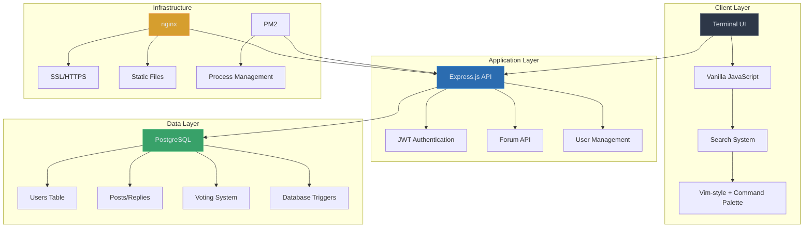
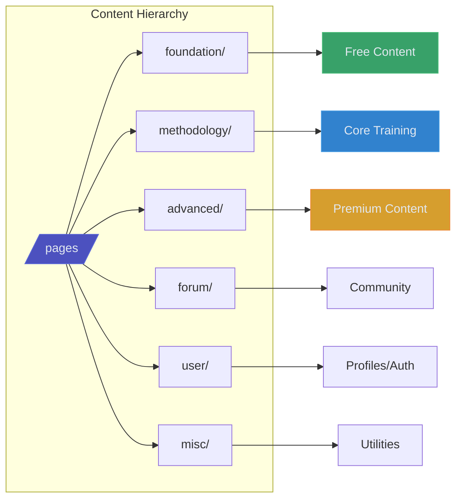
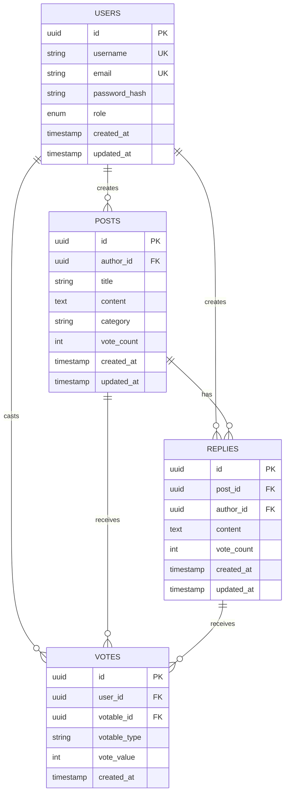
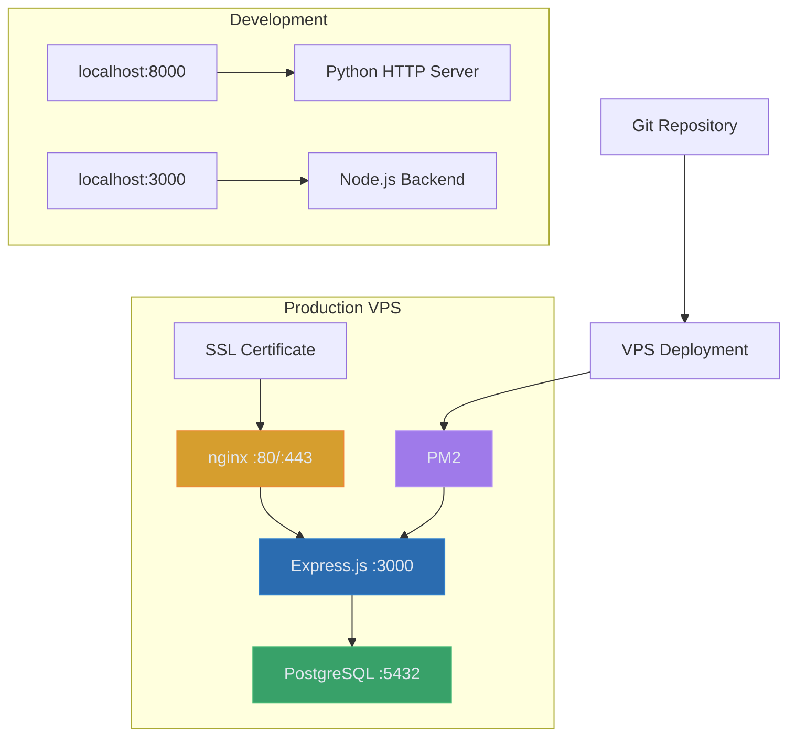
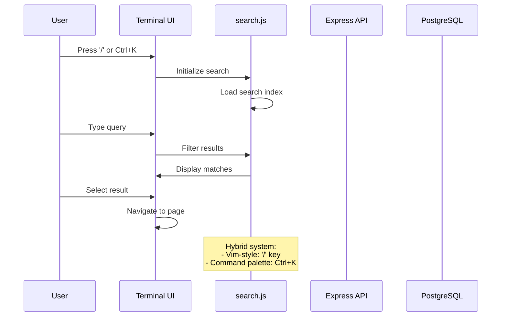
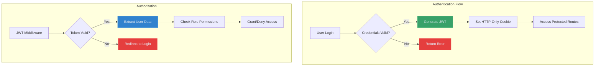

# ARCFORGE System Architecture

> Terminal-inspired forum platform with fortress navigation metaphor

**Tags:** #architecture #system-design #full-stack

## 🏗️ System Overview

ARCFORGE is a production-grade forum platform designed around the metaphor of navigating a digital fortress. Built for heavy duty training content with enterprise-level features.

## 🎯 Core Architecture Principles

### **Terminal-First Design**
- **Fortress Navigation**: File tree structure with collapsible folders
- **Vim-Inspired UX**: `j/k` navigation, `/` search, `Ctrl+K` command palette
- **Keyboard Accessibility**: Full functionality via keyboard shortcuts

### **Modular Content Structure**

## 🔧 Technology Stack

### **Frontend**
- **HTML5/CSS3**: Semantic markup with terminal aesthetics
- **Vanilla JavaScript**: No framework dependencies
- **JetBrains Mono**: Developer-focused typography
- **Root-relative paths**: Migration-proof resource loading

### **Backend**
- **Node.js + Express.js**: RESTful API server
- **PostgreSQL**: Production database with triggers
- **JWT + bcrypt**: Secure authentication system
- **PM2**: Process management and auto-restart

### **Infrastructure**
- **nginx**: Reverse proxy + static file serving
- **SSL/HTTPS**: Certificate-based security
- **VPS Hosting**: Production environment
- **Git**: Version control with feature branching

## 🗄️ Database Architecture

### **Advanced Database Features**
- **PostgreSQL Triggers**: Auto-update vote counts
- **UPSERT Operations**: Efficient vote toggling
- **Polymorphic Relations**: Unified voting system
- **UUID Primary Keys**: Production-ready scaling

## 🚀 Deployment Architecture

### **Critical Deployment Process**
1. **Local Development**: Test with Python HTTP server
2. **Commit & Push**: Version control all changes
3. **VPS Deployment**: Pull latest + PM2 restart
4. **Database Migrations**: Auto-run on PM2 restart

## 🔍 Search System Architecture

## 🎯 Key Design Decisions

Refer to [Architecture Decision Records](adr/) for detailed rationale:
- [Terminal Interface Design](adr/001-terminal-interface-design.md)
- [Hybrid Search System](adr/002-hybrid-search-system.md)
- [Vanilla JavaScript Choice](adr/003-vanilla-javascript-architecture.md)
- [Node.js Backend Selection](adr/004-nodejs-backend-choice.md)
- [HTML Structure Organization](adr/005-html-structure-organization.md)

## 📈 Scalability Considerations

### **Current Capacity**
- **Concurrent Users**: 100+ (single VPS)
- **Database**: PostgreSQL with indexing
- **Static Assets**: nginx caching
- **Session Management**: Stateless JWT

### **Future Scaling**
- **Horizontal Scaling**: Load balancer + multiple app servers
- **Database**: Read replicas for forum content
- **CDN**: Static asset distribution
- **Microservices**: Domain-specific services

## 🔐 Security Architecture

### **Security Features**
- **Password Hashing**: bcrypt with salt rounds
- **JWT Tokens**: Stateless authentication
- **HTTPS Everywhere**: SSL certificate protection
- **Input Validation**: Server-side sanitization
- **Role-Based Access**: Admin/user permissions

---

*This system has been battle-tested in production with real users and demonstrates enterprise-level architecture patterns.*