# Development Documentation

> Local setup, API documentation, and development workflows for ARCFORGE

**Tags:** #development #api #setup #local-development

## 🚀 Quick Start

- **[Local Setup](setup.md)** - Get ARCFORGE running locally
- **[API Documentation](api/)** - Complete backend API reference
- **[Testing Guide](testing.md)** - Manual testing procedures

## 🛠️ Development Stack

### **Backend**
- **Node.js + Express.js**: RESTful API server
- **PostgreSQL**: Production database with advanced features
- **JWT + bcrypt**: Secure authentication system
- **PM2**: Process management (production)

### **Frontend**
- **Vanilla JavaScript**: No framework dependencies
- **Root-relative paths**: Migration-proof asset loading
- **Terminal aesthetics**: Keyboard-first navigation
- **Progressive enhancement**: Works without JavaScript

### **Development Tools**
- **Python HTTP Server**: Frontend testing (`python3 -m http.server 8000`)
- **Docker**: PostgreSQL for local development
- **Git**: Version control with feature branching
- **Manual Testing**: Comprehensive test procedures

## 📂 Project Structure

```
arcForgeSite/
├── backend/                 # Node.js API server
│   ├── server.js           # Express app entry point
│   ├── routes/
│   │   ├── auth.js         # Authentication endpoints
│   │   └── forum.js        # Forum operations
│   ├── config/
│   │   └── database.js     # PostgreSQL connection
│   ├── migrations/         # Database schema files
│   └── scripts/            # Utility scripts
├── pages/                  # Frontend HTML (organized by feature)
│   ├── foundation/         # Free content
│   ├── methodology/        # Core training
│   ├── advanced/           # Premium content
│   ├── forum/              # Community pages
│   ├── user/               # Profile, settings
│   └── navigation/         # Terminal interface demo
├── css/                    # Stylesheets
├── js/                     # Frontend JavaScript
└── docs/                   # Project documentation
```

## 🔧 Local Development Workflow

### **1. Frontend Development**
```bash
# Start frontend server
cd /path/to/arcForgeSite
python3 -m http.server 8000

# Access at: http://localhost:8000
```

### **2. Backend Development**
```bash
# Install dependencies
cd backend/
npm install

# Start development server
npm run dev  # or node server.js

# API available at: http://localhost:3000
```

### **3. Database Development**
```bash
# Start PostgreSQL (Docker)
docker run --name arcforge-postgres \
  -e POSTGRES_PASSWORD=heavy_duty_123 \
  -p 5432:5432 -d postgres

# Run migrations
cd backend/
node scripts/createTables.js
```

## 🧪 Testing Strategy

### **Manual Testing**
- **Frontend**: Test pages via `localhost:8000`
- **API**: Use curl or Postman for endpoint testing
- **Integration**: Test full user workflows
- **Cross-browser**: Verify terminal interface compatibility

### **Testing Checklist**
- [ ] User registration and login
- [ ] Forum post creation and voting
- [ ] Search functionality (vim-style + command palette)
- [ ] Terminal navigation (keyboard shortcuts)
- [ ] Mobile responsiveness
- [ ] Admin moderation features

## 🔍 API Overview

The ARCFORGE API follows RESTful conventions with JWT authentication:

```mermaid
graph TD
    Client[🌐 Frontend] --> Auth[🔐 /api/auth/*]
    Client --> Forum[💬 /api/forum/*]
    Client --> Health[❤️ /api/health]
    
    Auth --> Login[📝 POST /login]
    Auth --> Register[👤 POST /signup]
    Auth --> Reset[🔑 POST /reset-password]
    
    Forum --> Categories[📂 GET /categories]
    Forum --> Posts[📄 GET /posts]
    Forum --> CreatePost[✍️ POST /posts]
    Forum --> Vote[⬆️ POST /vote]
    
    Login --> JWT[🎟️ JWT Token]
    CreatePost --> Protected[🛡️ Auth Required]
    Vote --> Protected
    
    style Auth fill:#4c51bf,stroke:#5a67d8,color:#e2e8f0
    style Forum fill:#2b6cb0,stroke:#3182ce,color:#e2e8f0
    style Protected fill:#e53e3e,stroke:#f56565,color:#e2e8f0
```



### **Authentication Flow**
1. **Login**: `POST /api/auth/login` returns JWT token
2. **Protected Routes**: Include `Authorization: Bearer <token>` header
3. **Token Validation**: Server verifies JWT on each request
4. **Session Management**: Stateless - no server-side sessions

## 🔐 Security Considerations

### **Development Environment**
- **Environment Variables**: Use `.env` file for secrets
- **Database Security**: Strong passwords for local PostgreSQL
- **CORS Configuration**: Restrict origins in production
- **Input Validation**: Sanitize all user inputs

### **Production Deployment**
- **HTTPS Only**: SSL certificate required
- **Secret Management**: Secure environment variable storage
- **Database Security**: Network restrictions and encryption
- **Rate Limiting**: Prevent API abuse

## 🚀 Performance Optimization

### **Database**
- **Connection Pooling**: Efficient PostgreSQL connections
- **Indexing Strategy**: Optimized for common queries
- **Denormalized Counters**: Vote counts cached for performance

### **Frontend**
- **Root-relative Paths**: Fast asset loading
- **Minimal Dependencies**: Vanilla JavaScript for speed
- **Lazy Loading**: Content loaded on demand

### **API**
- **JWT Stateless**: No server-side session storage
- **Efficient Queries**: Minimize database roundtrips
- **Caching Headers**: Browser caching for static content

## 📋 Development Guidelines

### **Code Style**
- **Consistent formatting**: Use existing project patterns
- **Error handling**: Proper try/catch blocks
- **Input validation**: Validate all user inputs
- **Documentation**: Comment complex logic

### **Git Workflow**
- **Feature branches**: Work on dedicated branches
- **Descriptive commits**: Clear commit messages
- **Testing**: Test before committing
- **Documentation**: Update docs with code changes

### **Database Changes**
- **Migration files**: Create numbered migration files
- **Backup first**: Always backup before schema changes
- **Test locally**: Verify migrations work correctly
- **Document changes**: Update schema documentation

---

*ARCFORGE demonstrates production-ready development practices with enterprise-level architecture patterns.*