# Operations Documentation

> Production deployment, infrastructure management, and monitoring for ARCFORGE

**Tags:** #operations #deployment #infrastructure #production

## 🚀 Quick Start

- **[Production Deployment](deployment.md)** - Complete VPS deployment guide
- **[Infrastructure Setup](infrastructure.md)** - nginx, SSL, and server configuration
- **[Monitoring Guide](monitoring.md)** - Health checks and performance monitoring

## 🏗️ Production Architecture

ARCFORGE runs on cost-effective VPS infrastructure designed for high availability and performance on minimal resources.


## 💰 Cost-Effective Infrastructure

### **VPS Specifications**
- **Provider**: Vultr/DigitalOcean/Linode
- **Cost**: $3.50-6/month
- **RAM**: 512MB-1GB
- **Storage**: 10-25GB SSD
- **Bandwidth**: 500GB-1TB
- **OS**: Debian 12 (resource efficient)

### **Resource Optimization**
- **No Docker**: Native PostgreSQL saves ~100MB RAM
- **PM2 Process Management**: Efficient Node.js scaling
- **nginx**: High-performance reverse proxy + static files
- **Minimal Dependencies**: Only essential packages installed

## 🔧 Deployment Strategy

### **Git-Based Deployment**


### **Zero-Downtime Deployment**
1. **Code Update**: Git pull latest changes
2. **Dependency Install**: `npm ci --production`
3. **Database Migration**: Auto-run on PM2 restart
4. **Graceful Restart**: PM2 handles process cycling
5. **Health Verification**: Automatic health checks

## 🛡️ Security Configuration

### **Server Hardening**
- **SSH Key Authentication**: No password login
- **Firewall Configuration**: UFW with minimal open ports
- **Automatic Updates**: Unattended security upgrades
- **Fail2Ban**: Intrusion prevention system

### **Application Security**
- **HTTPS Only**: SSL/TLS encryption via Let's Encrypt
- **Security Headers**: nginx security configuration
- **Rate Limiting**: API abuse prevention
- **Input Validation**: SQL injection and XSS protection

### **Database Security**
- **Network Restrictions**: PostgreSQL local-only access
- **Strong Passwords**: Production-grade credentials
- **Regular Backups**: Automated database backups
- **Connection Limits**: Prevent resource exhaustion

## 📊 Monitoring and Maintenance

### **Application Monitoring**

```mermaid
graph LR
    subgraph "Health Monitoring"
        API[🔗 API Endpoints] --> Health[❤️ Health Checks]
        DB[🗄️ Database] --> Health
        Disk[💾 Disk Usage] --> Health
        Memory[🧠 Memory Usage] --> Health
    end
    
    subgraph "Log Management"
        PM2Logs[📝 PM2 Logs] --> Rotation[🔄 Log Rotation]
        nginxLogs[📋 nginx Logs] --> Rotation
        DBLogs[📊 DB Logs] --> Rotation
    end
    
    subgraph "Alerting"
        Health --> Alerts[🚨 Alerts]
        Errors[❌ Error Rates] --> Alerts
        Response[⏱️ Response Times] --> Alerts
    end
    
    style Health fill:#38a169,stroke:#48bb78,color:#e2e8f0
    style Alerts fill:#e53e3e,stroke:#f56565,color:#e2e8f0
```


### **Performance Metrics**
- **Response Times**: API endpoint performance
- **Memory Usage**: PM2 process monitoring
- **Database Performance**: Query execution times
- **Disk Usage**: Storage capacity monitoring
- **Error Rates**: Application error tracking

### **Maintenance Tasks**
- **Daily**: Automated backups
- **Weekly**: Log rotation and cleanup
- **Monthly**: Security updates
- **Quarterly**: Performance optimization review

## ⚡ Performance Optimization

### **nginx Configuration**
- **Static File Caching**: Long-term browser caching
- **Gzip Compression**: Reduced bandwidth usage
- **HTTP/2 Support**: Improved connection efficiency
- **Connection Pooling**: Efficient upstream connections

### **Database Optimization**
- **Connection Pooling**: pg pool for Node.js
- **Query Optimization**: Strategic indexing
- **Vacuum Scheduling**: Automated PostgreSQL maintenance
- **Backup Strategies**: Point-in-time recovery

### **Application Performance**
- **PM2 Clustering**: Multi-core utilization
- **Memory Management**: Efficient garbage collection
- **Caching Strategies**: Redis for future scaling
- **CDN Integration**: Static asset distribution

## 🔄 Backup and Recovery

### **Backup Strategy**
```bash
# Daily automated backups
0 2 * * * /opt/scripts/backup-database.sh
0 3 * * * /opt/scripts/backup-files.sh

# Weekly full system backup
0 1 * * 0 /opt/scripts/full-backup.sh
```

### **Recovery Procedures**
1. **Database Recovery**: Point-in-time restoration
2. **File Recovery**: Static asset restoration
3. **Application Recovery**: Git-based code recovery
4. **Full System Recovery**: Complete VPS restoration

## 📈 Scaling Considerations

### **Vertical Scaling**
- **RAM Upgrade**: 512MB → 1GB → 2GB progression
- **CPU Upgrade**: Single → dual core for higher traffic
- **Storage Expansion**: SSD upgrade for larger datasets

### **Horizontal Scaling**
- **Load Balancer**: nginx upstream configuration
- **Database Replication**: PostgreSQL read replicas
- **CDN Integration**: Global asset distribution
- **Microservices**: Service separation for scale

## 🚨 Incident Response

### **Common Issues**
- **High Memory Usage**: PM2 process restart
- **Database Locks**: Query optimization
- **SSL Certificate Expiry**: Automated renewal
- **Disk Space**: Log cleanup procedures

### **Emergency Procedures**
- **Service Recovery**: PM2 restart commands
- **Database Recovery**: Backup restoration
- **Rollback Deployment**: Git revert + restart
- **Communication**: Status page updates

---

*This operations setup demonstrates production-ready infrastructure management with enterprise-level reliability on budget-friendly VPS hosting.*