# Production Deployment Guide

> Complete VPS deployment process for ARCFORGE platform

**Tags:** #deployment #vps #production #nginx #postgresql

## 🎯 Deployment Overview

This guide covers deploying ARCFORGE to a cost-effective VPS with enterprise-grade reliability. Optimized for minimal resources while maintaining production standards.

```mermaid
flowchart TD
    A[🖥️ Fresh VPS] --> B[🔧 Server Setup]
    B --> C[🗄️ Database Install]
    C --> D[🟢 Node.js Setup]
    D --> E[🔄 PM2 Configuration]
    E --> F[🌐 nginx Setup]
    F --> G[🔐 SSL Certificate]
    G --> H[📦 App Deployment]
    H --> I[✅ Production Ready]
    
    style A fill:#4c51bf,stroke:#5a67d8,color:#e2e8f0
    style C fill:#38a169,stroke:#48bb78,color:#e2e8f0
    style D fill:#2b6cb0,stroke:#3182ce,color:#e2e8f0
    style I fill:#38a169,stroke:#48bb78,color:#e2e8f0
```



## 🖥️ VPS Provider Setup

### **Recommended Providers**
- **Vultr**: $3.50/month (512MB RAM, 10GB SSD)
- **DigitalOcean**: $4/month (512MB RAM, 10GB SSD)
- **Linode**: $5/month (1GB RAM, 25GB SSD)

### **Server Specifications**
```bash
# Minimum requirements
RAM: 512MB (1GB recommended)
Storage: 10GB SSD
CPU: 1 vCPU
OS: Debian 12 (latest)
```

### **Initial Server Access**
```bash
# Connect via SSH (replace with your server IP)
ssh root@your.server.ip

# Update system packages
apt update && apt upgrade -y

# Install essential packages
apt install -y curl wget git ufw fail2ban unattended-upgrades
```

## 🛡️ Security Hardening

### **SSH Key Authentication**
```bash
# On your local machine, generate SSH key if you don't have one
ssh-keygen -t ed25519 -C "your_email@example.com"

# Copy public key to server
ssh-copy-id root@your.server.ip

# On server, disable password authentication
nano /etc/ssh/sshd_config

# Set these values:
PasswordAuthentication no
PermitRootLogin yes  # Change to 'no' after creating sudo user
PubkeyAuthentication yes

# Restart SSH service
systemctl restart ssh
```

### **Firewall Configuration**
```bash
# Configure UFW (Uncomplicated Firewall)
ufw default deny incoming
ufw default allow outgoing

# Allow SSH, HTTP, and HTTPS
ufw allow ssh
ufw allow 80/tcp
ufw allow 443/tcp

# Enable firewall
ufw enable

# Check status
ufw status verbose
```

### **Fail2Ban Setup**
```bash
# Configure Fail2Ban for SSH protection
cp /etc/fail2ban/jail.conf /etc/fail2ban/jail.local

# Edit configuration
nano /etc/fail2ban/jail.local

# Enable SSH protection
[sshd]
enabled = true
port = ssh
filter = sshd
logpath = /var/log/auth.log
maxretry = 3
bantime = 600

# Start and enable Fail2Ban
systemctl start fail2ban
systemctl enable fail2ban
```

## 🗄️ PostgreSQL Installation

### **Native PostgreSQL Setup**
```bash
# Install PostgreSQL (native, not Docker for resource efficiency)
apt update
apt install -y postgresql postgresql-contrib

# Start and enable PostgreSQL
systemctl start postgresql
systemctl enable postgresql

# Check service status
systemctl status postgresql
```

### **Database Configuration**
```bash
# Switch to postgres user and access PostgreSQL
sudo -u postgres psql

# Create production database and user
CREATE DATABASE arcforge_production;
CREATE USER arcforge_prod WITH PASSWORD 'your_strong_production_password';
GRANT ALL PRIVILEGES ON DATABASE arcforge_production TO arcforge_prod;

# Connect to the database and grant schema permissions
\c arcforge_production
GRANT ALL ON SCHEMA public TO arcforge_prod;
GRANT ALL PRIVILEGES ON ALL TABLES IN SCHEMA public TO arcforge_prod;
GRANT ALL PRIVILEGES ON ALL SEQUENCES IN SCHEMA public TO arcforge_prod;

# Exit PostgreSQL
\q
```

### **Database Security**
```bash
# Edit PostgreSQL configuration for security
nano /etc/postgresql/15/main/postgresql.conf

# Ensure local connections only (default is good)
listen_addresses = 'localhost'

# Edit pg_hba.conf for authentication
nano /etc/postgresql/15/main/pg_hba.conf

# Ensure local connections use password authentication
local   all             all                                     md5
host    all             all             127.0.0.1/32            md5

# Restart PostgreSQL
systemctl restart postgresql
```

## 🟢 Node.js and PM2 Setup

### **Node.js Installation**
```bash
# Install Node.js via NodeSource repository (latest LTS)
curl -fsSL https://deb.nodesource.com/setup_lts.x | sudo -E bash -
apt-get install -y nodejs

# Verify installation
node --version
npm --version
```

### **PM2 Process Manager**
```bash
# Install PM2 globally
npm install -g pm2

# Configure PM2 for system startup
pm2 startup

# Follow the generated command (usually something like):
# sudo env PATH=$PATH:/usr/bin /usr/lib/node_modules/pm2/bin/pm2 startup systemd -u root --hp /root

# Verify PM2 installation
pm2 --version
```

## 🌐 nginx Installation and Configuration

### **nginx Setup**
```bash
# Install nginx
apt install -y nginx

# Start and enable nginx
systemctl start nginx
systemctl enable nginx

# Test nginx is running
curl http://localhost
```

### **nginx Configuration for ARCFORGE**
```bash
# Create ARCFORGE site configuration
nano /etc/nginx/sites-available/arcforge

# Add this configuration:
server {
    listen 80;
    server_name your-domain.com www.your-domain.com;
    
    # Redirect HTTP to HTTPS (will be configured after SSL)
    return 301 https://$server_name$request_uri;
}

server {
    listen 443 ssl http2;
    server_name your-domain.com www.your-domain.com;
    
    # SSL configuration (certificates will be added by Certbot)
    ssl_certificate /etc/letsencrypt/live/your-domain.com/fullchain.pem;
    ssl_certificate_key /etc/letsencrypt/live/your-domain.com/privkey.pem;
    
    # Security headers
    add_header X-Frame-Options DENY;
    add_header X-Content-Type-Options nosniff;
    add_header X-XSS-Protection "1; mode=block";
    add_header Strict-Transport-Security "max-age=31536000; includeSubDomains" always;
    
    # Root directory for static files
    root /var/www/arcforge;
    index index.html;
    
    # Static file handling with caching
    location / {
        try_files $uri $uri/ @proxy;
        
        # Cache static assets
        location ~* \.(js|css|png|jpg|jpeg|gif|ico|svg)$ {
            expires 1y;
            add_header Cache-Control "public, immutable";
        }
    }
    
    # Proxy API requests to Node.js
    location @proxy {
        proxy_pass http://localhost:3000;
        proxy_http_version 1.1;
        proxy_set_header Upgrade $http_upgrade;
        proxy_set_header Connection 'upgrade';
        proxy_set_header Host $host;
        proxy_set_header X-Real-IP $remote_addr;
        proxy_set_header X-Forwarded-For $proxy_add_x_forwarded_for;
        proxy_set_header X-Forwarded-Proto $scheme;
        proxy_cache_bypass $http_upgrade;
    }
    
    # API routes specifically
    location /api/ {
        proxy_pass http://localhost:3000;
        proxy_http_version 1.1;
        proxy_set_header Upgrade $http_upgrade;
        proxy_set_header Connection 'upgrade';
        proxy_set_header Host $host;
        proxy_set_header X-Real-IP $remote_addr;
        proxy_set_header X-Forwarded-For $proxy_add_x_forwarded_for;
        proxy_set_header X-Forwarded-Proto $scheme;
        proxy_cache_bypass $http_upgrade;
    }
    
    # Gzip compression
    gzip on;
    gzip_vary on;
    gzip_min_length 1024;
    gzip_types text/plain text/css text/xml text/javascript application/javascript application/json;
}

# Enable the site
ln -s /etc/nginx/sites-available/arcforge /etc/nginx/sites-enabled/

# Remove default site
rm /etc/nginx/sites-enabled/default

# Test nginx configuration
nginx -t

# Reload nginx
systemctl reload nginx
```

## 🔐 SSL Certificate Setup

### **Let's Encrypt with Certbot**
```bash
# Install Certbot
apt install -y certbot python3-certbot-nginx

# Obtain SSL certificate (replace with your domain)
certbot --nginx -d your-domain.com -d www.your-domain.com

# Follow prompts:
# - Enter email address
# - Agree to terms
# - Choose redirect option (recommended)

# Test automatic renewal
certbot renew --dry-run

# Set up automatic renewal (already configured by default)
systemctl status snap.certbot.renew.timer
```

## 📦 Application Deployment

### **Clone and Setup Application**
```bash
# Create application directory
mkdir -p /var/www
cd /var/www

# Clone repository (replace with your repo URL)
git clone https://github.com/your-username/arcForgeSite.git arcforge
cd arcforge

# Install production dependencies
npm ci --production

# Create production environment file
nano .env

# Add production environment variables:
NODE_ENV=production
PORT=3000
DB_HOST=localhost
DB_PORT=5432
DB_NAME=arcforge_production
DB_USER=arcforge_prod
DB_PASSWORD=your_strong_production_password
JWT_SECRET=your_super_secure_jwt_secret_key_here

# Email configuration (if using email features)
EMAIL_HOST=smtp.gmail.com
EMAIL_PORT=587
EMAIL_USER=your_email@gmail.com
EMAIL_PASS=your_app_password
```

### **Database Schema Setup**
```bash
# Run database migrations
cd /var/www/arcforge/backend
node scripts/createTables.js

# Verify tables were created
sudo -u postgres psql -d arcforge_production -c "\dt"
```

### **PM2 Application Configuration**
```bash
# Create PM2 ecosystem file
nano /var/www/arcforge/ecosystem.config.js

# Add PM2 configuration:
module.exports = {
  apps: [{
    name: 'arcforge',
    script: './backend/server.js',
    cwd: '/var/www/arcforge',
    instances: 1,
    exec_mode: 'fork',
    env: {
      NODE_ENV: 'production',
      PORT: 3000
    },
    error_file: '/var/log/pm2/arcforge-error.log',
    out_file: '/var/log/pm2/arcforge-out.log',
    log_file: '/var/log/pm2/arcforge.log',
    time: true,
    autorestart: true,
    watch: false,
    max_memory_restart: '200M'
  }]
};

# Create log directory
mkdir -p /var/log/pm2

# Start application with PM2
cd /var/www/arcforge
pm2 start ecosystem.config.js

# Save PM2 configuration
pm2 save

# Check application status
pm2 status
pm2 logs arcforge
```

## ✅ Deployment Verification

### **Health Checks**
```bash
# Check all services are running
systemctl status nginx
systemctl status postgresql
pm2 status

# Test API endpoints
curl http://localhost:3000/api/health
curl https://your-domain.com/api/health

# Check database connectivity
sudo -u postgres psql -d arcforge_production -c "SELECT version();"

# Verify SSL certificate
curl -I https://your-domain.com
```

### **Performance Testing**
```bash
# Test response times
time curl https://your-domain.com

# Check memory usage
free -h
pm2 monit

# Monitor logs
pm2 logs arcforge --lines 50
tail -f /var/log/nginx/access.log
```

## 🔄 Deployment Automation

### **Update Script**
```bash
# Create deployment script
nano /opt/scripts/deploy.sh

#!/bin/bash
set -e

echo "Starting ARCFORGE deployment..."

# Navigate to app directory
cd /var/www/arcforge

# Pull latest changes
git pull origin main

# Install dependencies
npm ci --production

# Run database migrations (if any)
cd backend && node scripts/createTables.js && cd ..

# Restart application
pm2 restart arcforge

# Wait for application to start
sleep 5

# Health check
if curl -f http://localhost:3000/api/health; then
    echo "Deployment successful!"
else
    echo "Deployment failed - health check failed"
    exit 1
fi

# Make script executable
chmod +x /opt/scripts/deploy.sh
```

### **Backup Script**
```bash
# Create backup script
nano /opt/scripts/backup.sh

#!/bin/bash
DATE=$(date +%Y%m%d_%H%M%S)
BACKUP_DIR="/var/backups/arcforge"

# Create backup directory
mkdir -p $BACKUP_DIR

# Backup database
sudo -u postgres pg_dump arcforge_production > $BACKUP_DIR/db_backup_$DATE.sql

# Backup application files
tar -czf $BACKUP_DIR/app_backup_$DATE.tar.gz -C /var/www arcforge

# Keep only last 7 days of backups
find $BACKUP_DIR -name "*.sql" -mtime +7 -delete
find $BACKUP_DIR -name "*.tar.gz" -mtime +7 -delete

echo "Backup completed: $DATE"

# Make script executable
chmod +x /opt/scripts/backup.sh

# Add to crontab for daily backups
crontab -e

# Add this line:
0 2 * * * /opt/scripts/backup.sh >> /var/log/backup.log 2>&1
```

## 🚨 Troubleshooting

### **Common Issues**

#### **Service Not Starting**
```bash
# Check PM2 logs
pm2 logs arcforge

# Check nginx logs
tail -f /var/log/nginx/error.log

# Check PostgreSQL logs
tail -f /var/log/postgresql/postgresql-15-main.log
```

#### **Database Connection Issues**
```bash
# Test database connection
sudo -u postgres psql -d arcforge_production

# Check PostgreSQL is running
systemctl status postgresql

# Verify user permissions
sudo -u postgres psql -c "\du"
```

#### **SSL Certificate Issues**
```bash
# Check certificate status
certbot certificates

# Renew certificate manually
certbot renew

# Test nginx configuration
nginx -t
```

#### **Memory Issues**
```bash
# Check memory usage
free -h
pm2 monit

# Restart application if needed
pm2 restart arcforge
```

---

*This deployment guide ensures production-ready hosting with enterprise-level reliability on cost-effective VPS infrastructure.*