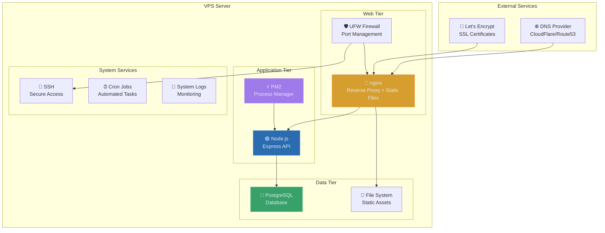

# Infrastructure Configuration

> nginx, SSL, and server optimization for production ARCFORGE deployment

**Tags:** #infrastructure #nginx #ssl #optimization #security

## 🏗️ Infrastructure Overview

ARCFORGE uses a streamlined infrastructure stack optimized for cost-effectiveness and performance on minimal VPS resources.



## 🔧 nginx Configuration

### **Production nginx.conf**
```nginx
# /etc/nginx/nginx.conf
user www-data;
worker_processes auto;
worker_rlimit_nofile 65535;

events {
    worker_connections 1024;
    use epoll;
    multi_accept on;
}

http {
    # Basic settings
    sendfile on;
    tcp_nopush on;
    tcp_nodelay on;
    keepalive_timeout 65;
    types_hash_max_size 2048;
    server_tokens off;
    
    # MIME types
    include /etc/nginx/mime.types;
    default_type application/octet-stream;
    
    # Logging
    log_format main '$remote_addr - $remote_user [$time_local] "$request" '
                    '$status $body_bytes_sent "$http_referer" '
                    '"$http_user_agent" "$http_x_forwarded_for" '
                    '$request_time $upstream_response_time';
                    
    access_log /var/log/nginx/access.log main;
    error_log /var/log/nginx/error.log warn;
    
    # Gzip compression
    gzip on;
    gzip_vary on;
    gzip_min_length 1024;
    gzip_proxied any;
    gzip_comp_level 6;
    gzip_types
        text/plain
        text/css
        text/xml
        text/javascript
        application/json
        application/javascript
        application/xml+rss
        application/atom+xml
        image/svg+xml;
    
    # Rate limiting
    limit_req_zone $binary_remote_addr zone=api:10m rate=10r/s;
    limit_req_zone $binary_remote_addr zone=login:10m rate=1r/s;
    
    # Include virtual hosts
    include /etc/nginx/sites-enabled/*;
}
```

### **ARCFORGE Virtual Host**
```nginx
# /etc/nginx/sites-available/arcforge
server {
    listen 80;
    server_name arcforge.tech www.arcforge.tech;
    
    # Redirect all HTTP to HTTPS
    return 301 https://$server_name$request_uri;
}

server {
    listen 443 ssl http2;
    server_name arcforge.tech www.arcforge.tech;
    
    # SSL Configuration
    ssl_certificate /etc/letsencrypt/live/arcforge.tech/fullchain.pem;
    ssl_certificate_key /etc/letsencrypt/live/arcforge.tech/privkey.pem;
    ssl_trusted_certificate /etc/letsencrypt/live/arcforge.tech/chain.pem;
    
    # SSL Security Settings
    ssl_protocols TLSv1.2 TLSv1.3;
    ssl_ciphers ECDHE-RSA-AES256-GCM-SHA512:DHE-RSA-AES256-GCM-SHA512:ECDHE-RSA-AES256-GCM-SHA384:DHE-RSA-AES256-GCM-SHA384;
    ssl_prefer_server_ciphers off;
    ssl_session_cache shared:SSL:10m;
    ssl_session_timeout 10m;
    ssl_session_tickets off;
    ssl_stapling on;
    ssl_stapling_verify on;
    
    # Security Headers
    add_header Strict-Transport-Security "max-age=31536000; includeSubDomains; preload" always;
    add_header X-Frame-Options DENY always;
    add_header X-Content-Type-Options nosniff always;
    add_header X-XSS-Protection "1; mode=block" always;
    add_header Referrer-Policy "strict-origin-when-cross-origin" always;
    add_header Content-Security-Policy "default-src 'self'; script-src 'self' 'unsafe-inline'; style-src 'self' 'unsafe-inline' fonts.googleapis.com; font-src 'self' fonts.gstatic.com; img-src 'self' data:; connect-src 'self'" always;
    
    # Document root
    root /var/www/arcforge;
    index index.html;
    
    # Static file handling with aggressive caching
    location / {
        try_files $uri $uri/ @proxy;
        
        # Cache static assets
        location ~* \.(js|css|png|jpg|jpeg|gif|ico|svg|woff|woff2|ttf|eot)$ {
            expires 1y;
            add_header Cache-Control "public, immutable";
            add_header Vary "Accept-Encoding";
            access_log off;
        }
        
        # Cache HTML with shorter duration
        location ~* \.(html)$ {
            expires 1h;
            add_header Cache-Control "public, must-revalidate";
        }
    }
    
    # API routes with rate limiting
    location /api/ {
        # Rate limiting
        limit_req zone=api burst=20 nodelay;
        
        # Special rate limiting for auth endpoints
        location /api/auth/ {
            limit_req zone=login burst=5 nodelay;
            proxy_pass http://localhost:3000;
            include /etc/nginx/proxy_params;
        }
        
        proxy_pass http://localhost:3000;
        include /etc/nginx/proxy_params;
    }
    
    # Fallback to Node.js application
    location @proxy {
        proxy_pass http://localhost:3000;
        include /etc/nginx/proxy_params;
    }
    
    # Health check endpoint (no rate limiting)
    location /api/health {
        proxy_pass http://localhost:3000;
        include /etc/nginx/proxy_params;
        access_log off;
    }
    
    # Deny access to sensitive files
    location ~ /\. {
        deny all;
        access_log off;
        log_not_found off;
    }
    
    location ~ /(\.git|\.env|package\.json|ecosystem\.config\.js) {
        deny all;
        access_log off;
        log_not_found off;
    }
}
```

### **Proxy Parameters**
```nginx
# /etc/nginx/proxy_params
proxy_set_header Host $http_host;
proxy_set_header X-Real-IP $remote_addr;
proxy_set_header X-Forwarded-For $proxy_add_x_forwarded_for;
proxy_set_header X-Forwarded-Proto $scheme;
proxy_set_header X-Forwarded-Host $server_name;
proxy_set_header X-Forwarded-Port $server_port;

proxy_http_version 1.1;
proxy_set_header Upgrade $http_upgrade;
proxy_set_header Connection "upgrade";

proxy_cache_bypass $http_upgrade;
proxy_redirect off;

# Timeouts
proxy_connect_timeout 60s;
proxy_send_timeout 60s;
proxy_read_timeout 60s;

# Buffer settings
proxy_buffering on;
proxy_buffer_size 128k;
proxy_buffers 4 256k;
proxy_busy_buffers_size 256k;
```

## 🔐 SSL/TLS Configuration

### **Let's Encrypt Automation**
```bash
# Certbot configuration for automatic renewal
# /etc/letsencrypt/renewal-hooks/deploy/nginx-reload.sh
#!/bin/bash
systemctl reload nginx

# Make executable
chmod +x /etc/letsencrypt/renewal-hooks/deploy/nginx-reload.sh

# Test automatic renewal
certbot renew --dry-run

# Check renewal timer
systemctl list-timers | grep certbot
```

### **SSL Security Testing**
```bash
# Test SSL configuration with SSL Labs
# Visit: https://www.ssllabs.com/ssltest/

# Test with local tools
openssl s_client -connect arcforge.tech:443 -servername arcforge.tech

# Check certificate expiry
echo | openssl s_client -servername arcforge.tech -connect arcforge.tech:443 2>/dev/null | openssl x509 -noout -dates
```

### **HSTS and Security Headers**
```nginx
# Advanced security configuration
add_header Strict-Transport-Security "max-age=31536000; includeSubDomains; preload" always;
add_header X-Frame-Options DENY always;
add_header X-Content-Type-Options nosniff always;
add_header X-XSS-Protection "1; mode=block" always;
add_header Referrer-Policy "strict-origin-when-cross-origin" always;

# Content Security Policy
add_header Content-Security-Policy "
    default-src 'self';
    script-src 'self' 'unsafe-inline';
    style-src 'self' 'unsafe-inline' fonts.googleapis.com;
    font-src 'self' fonts.gstatic.com;
    img-src 'self' data:;
    connect-src 'self';
    frame-ancestors 'none';
    base-uri 'self';
    form-action 'self'
" always;
```

## 🛡️ Firewall and Security

### **UFW Configuration**
```bash
# Reset UFW to defaults
ufw --force reset

# Default policies
ufw default deny incoming
ufw default allow outgoing

# Allow essential services
ufw allow ssh
ufw allow 80/tcp
ufw allow 443/tcp

# Rate limiting for SSH
ufw limit ssh

# Enable firewall
ufw enable

# Check status
ufw status verbose

# Advanced rules (if needed)
# Allow specific IP for admin access
# ufw allow from 192.168.1.100 to any port 22

# Block specific countries (example)
# ufw deny from 192.168.0.0/16
```

### **Fail2Ban Configuration**
```ini
# /etc/fail2ban/jail.local
[DEFAULT]
bantime = 3600
findtime = 600
maxretry = 3
backend = systemd

[sshd]
enabled = true
port = ssh
filter = sshd
logpath = /var/log/auth.log
maxretry = 3
bantime = 1800

[nginx-http-auth]
enabled = true
filter = nginx-http-auth
logpath = /var/log/nginx/error.log
maxretry = 3

[nginx-req-limit]
enabled = true
filter = nginx-req-limit
logpath = /var/log/nginx/error.log
maxretry = 5
bantime = 600

[nginx-badbots]
enabled = true
filter = nginx-badbots
logpath = /var/log/nginx/access.log
maxretry = 3
bantime = 86400
```

### **System Hardening**
```bash
# Disable unnecessary services
systemctl disable bluetooth
systemctl disable cups
systemctl disable avahi-daemon

# Set kernel parameters for security
echo 'net.ipv4.conf.default.rp_filter=1' >> /etc/sysctl.conf
echo 'net.ipv4.conf.all.rp_filter=1' >> /etc/sysctl.conf
echo 'net.ipv4.icmp_echo_ignore_broadcasts=1' >> /etc/sysctl.conf
echo 'net.ipv4.conf.all.accept_redirects=0' >> /etc/sysctl.conf
echo 'net.ipv6.conf.all.accept_redirects=0' >> /etc/sysctl.conf
echo 'net.ipv4.conf.all.send_redirects=0' >> /etc/sysctl.conf
echo 'net.ipv4.conf.all.accept_source_route=0' >> /etc/sysctl.conf
echo 'net.ipv6.conf.all.accept_source_route=0' >> /etc/sysctl.conf

# Apply settings
sysctl -p
```

## 📊 Performance Optimization

### **nginx Performance Tuning**
```nginx
# Worker process optimization
worker_processes auto;
worker_rlimit_nofile 65535;

events {
    worker_connections 1024;
    use epoll;
    multi_accept on;
}

# HTTP optimization
http {
    sendfile on;
    tcp_nopush on;
    tcp_nodelay on;
    keepalive_timeout 65;
    keepalive_requests 100;
    
    # Client settings
    client_max_body_size 10M;
    client_body_timeout 12;
    client_header_timeout 12;
    send_timeout 10;
    
    # Gzip optimization
    gzip on;
    gzip_vary on;
    gzip_min_length 1024;
    gzip_proxied any;
    gzip_comp_level 6;
}
```

### **File System Optimization**
```bash
# Optimize file system for SSD
echo 'deadline' > /sys/block/vda/queue/scheduler

# Set mount options for performance
# /etc/fstab
/dev/vda1 / ext4 defaults,noatime,discard 0 1

# Optimize PostgreSQL for limited RAM
# /etc/postgresql/15/main/postgresql.conf
shared_buffers = 128MB
effective_cache_size = 256MB
maintenance_work_mem = 32MB
max_connections = 20
```

### **Log Rotation**
```bash
# Configure log rotation for nginx
# /etc/logrotate.d/nginx
/var/log/nginx/*.log {
    daily
    missingok
    rotate 30
    compress
    delaycompress
    notifempty
    create 644 www-data adm
    sharedscripts
    prerotate
        if [ -d /etc/logrotate.d/httpd-prerotate ]; then \
            run-parts /etc/logrotate.d/httpd-prerotate; \
        fi \
    endscript
    postrotate
        invoke-rc.d nginx rotate >/dev/null 2>&1
    endscript
}

# Configure log rotation for application
# /etc/logrotate.d/arcforge
/var/log/pm2/*.log {
    daily
    rotate 7
    compress
    delaycompress
    missingok
    notifempty
    sharedscripts
    postrotate
        pm2 reloadLogs
    endscript
}
```

## 🔍 Monitoring and Health Checks

### **nginx Status Monitoring**
```nginx
# Add status endpoint to nginx configuration
server {
    listen 127.0.0.1:8080;
    server_name localhost;
    
    location /nginx_status {
        stub_status on;
        access_log off;
        allow 127.0.0.1;
        deny all;
    }
}
```

### **Health Check Scripts**
```bash
# /opt/scripts/health-check.sh
#!/bin/bash

# Check nginx
if ! systemctl is-active --quiet nginx; then
    echo "CRITICAL: nginx is not running"
    exit 2
fi

# Check PostgreSQL
if ! systemctl is-active --quiet postgresql; then
    echo "CRITICAL: PostgreSQL is not running"
    exit 2
fi

# Check application
if ! curl -sf http://localhost:3000/api/health > /dev/null; then
    echo "CRITICAL: Application health check failed"
    exit 2
fi

# Check disk space
DISK_USAGE=$(df / | awk 'NR==2 {print $5}' | sed 's/%//')
if [ $DISK_USAGE -gt 90 ]; then
    echo "WARNING: Disk usage is ${DISK_USAGE}%"
    exit 1
fi

# Check memory usage
MEMORY_USAGE=$(free | awk 'NR==2{printf "%.0f", $3*100/$2}')
if [ $MEMORY_USAGE -gt 90 ]; then
    echo "WARNING: Memory usage is ${MEMORY_USAGE}%"
    exit 1
fi

echo "OK: All systems operational"
exit 0
```

### **Automated Monitoring**
```bash
# Add to crontab for regular health checks
crontab -e

# Check every 5 minutes
*/5 * * * * /opt/scripts/health-check.sh >> /var/log/health-check.log 2>&1

# Daily system report
0 6 * * * /opt/scripts/daily-report.sh | mail -s "Daily Server Report" admin@yourdomain.com
```

---

*This infrastructure configuration provides enterprise-grade security, performance, and reliability on cost-effective VPS hosting.*