# Product Documentation

> Feature specifications, user guides, and product roadmap for ARCFORGE platform

**Tags:** #product #features #roadmap #specifications

## 🎯 Product Overview

ARCFORGE is a premium forum platform designed with terminal aesthetics and developer-focused features. Built for professional communities that value performance, security, and unique user experience.

**Key Design Philosophy**: Developer-friendly features with mainstream accessibility - we use developer-inspired UX (terminal aesthetics, keyboard shortcuts) but design for broader audiences who may not be technical.

## 🗺️ Quick Navigation

- **[Feature Specifications](features.md)** - Detailed feature documentation
- **[Product Roadmap](roadmap.md)** - Development timeline and future plans
- **[User Guide](user-guide.md)** - End-user documentation
- **[Admin Guide](admin-guide.md)** - Administrative features

## 👥 User Personas & Audience Strategy

### **Primary Audience (70%): Fitness Enthusiasts & General Users**
- **Profile**: People interested in fitness/training content who appreciate clean, professional interfaces
- **Technical Level**: Limited - may not know Markdown, prefer visual editors
- **Needs**: Easy content creation, intuitive navigation, mobile-friendly experience
- **Feature Preferences**: Rich text editors, visual formatting, simple interfaces

### **Secondary Audience (25%): Tech-Savvy Power Users**  
- **Profile**: Developers, engineers, technical professionals who like efficiency
- **Technical Level**: High - comfortable with Markdown, keyboard shortcuts, CLI tools
- **Needs**: Speed, keyboard navigation, advanced features, customization
- **Feature Preferences**: Markdown, vim shortcuts, command palette, advanced search

### **Tertiary Audience (5%): Content Creators & Admins**
- **Profile**: Community managers, fitness professionals, content creators
- **Technical Level**: Moderate - willing to learn tools for content creation
- **Needs**: Content management, analytics, moderation tools, SEO features
- **Feature Preferences**: Rich editing tools, analytics dashboards, bulk operations

## 🎯 **Design Principle: "Developer UX, Mainstream Accessibility"**

**The Strategy**: Use developer-inspired aesthetics and optional power features, but ensure core functionality is accessible to non-technical users.

**Examples**:
- ✅ **Terminal aesthetics** (looks cool to everyone)
- ✅ **Optional vim shortcuts** (power users love them, others ignore them)  
- ✅ **Rich text editor WITH Markdown option** (accessible to all, powerful for devs)
- ✅ **Command palette** (discoverable for beginners, efficient for experts)

**Feature Decision Framework**:
- **Always accessible**: Core features work for non-technical users
- **Progressive enhancement**: Advanced features available for power users
- **Visual first**: Default to visual/GUI options, offer text/code alternatives

## 🏗️ Product Architecture

ARCFORGE combines modern web technologies with terminal-inspired design to create a unique forum experience.

```mermaid
graph TB
    subgraph "User Experience"
        Terminal[🖥️ Terminal Interface]
        Vim[⌨️ Vim-Style Navigation]
        Search[🔍 Command Palette]
        Mobile[📱 Mobile Responsive]
    end
    
    subgraph "Core Features"
        Auth[🔐 Authentication]
        Forum[💬 Forum System]
        Voting[👍 Voting System]
        Premium[💎 Premium Tiers]
    end
    
    subgraph "Technical Stack"
        Frontend[🌐 Vanilla JS]
        Backend[🟢 Node.js/Express]
        Database[🗄️ PostgreSQL]
        Security[🛡️ JWT + bcrypt]
    end
    
    subgraph "Deployment"
        VPS[☁️ VPS Hosting]
        nginx[🔧 nginx]
        PM2[⚡ PM2]
        SSL[🔐 SSL/TLS]
    end
    
    Terminal --> Auth
    Vim --> Forum
    Search --> Voting
    Mobile --> Premium
    
    Auth --> Frontend
    Forum --> Backend
    Voting --> Database
    Premium --> Security
    
    Frontend --> VPS
    Backend --> nginx
    Database --> PM2
    Security --> SSL
    
    style Terminal fill:#4c51bf,stroke:#5a67d8,color:#e2e8f0
    style Forum fill:#38a169,stroke:#48bb78,color:#e2e8f0
    style Backend fill:#2b6cb0,stroke:#3182ce,color:#e2e8f0
    style VPS fill:#d69e2e,stroke:#ed8936,color:#e2e8f0
```

## 🎨 Design Philosophy

### **Terminal Aesthetics**
- **Monospace Typography**: Professional developer-friendly fonts
- **Dark Theme**: Easy on the eyes for extended use
- **Minimalist Interface**: Focus on content over decoration
- **Command-Line Inspiration**: Familiar patterns for developers

### **Developer Experience**
- **Keyboard-First Navigation**: Vim-style shortcuts (j/k, /, Ctrl+K)
- **Fast Performance**: Vanilla JS for optimal speed
- **Clean Code**: Maintainable and well-documented
- **Modern Standards**: ES6+, semantic HTML, accessible design

## 🎯 Target Audience

### **Primary Users**
- **Software Developers**: Looking for technical discussion platforms
- **Tech Communities**: Seeking premium forum experiences
- **Professional Teams**: Needing internal discussion boards
- **Developer Tool Companies**: Wanting branded community platforms

### **Use Cases**
- **Technical Documentation**: API discussions, code reviews
- **Community Building**: Developer meetups, tool discussions
- **Internal Teams**: Private project discussions
- **Knowledge Sharing**: Best practices, troubleshooting

## 💰 Business Model

### **Freemium Structure**
- **Free Tier**: Basic forum access, public categories
- **Premium Tier**: Advanced features, private categories
- **Admin Controls**: Moderation tools, analytics
- **Enterprise**: Custom branding, dedicated support

### **Value Proposition**
- **Unique Experience**: Terminal-inspired design stands out
- **Performance**: Fast, lightweight, mobile-friendly
- **Security**: Enterprise-grade authentication and data protection
- **Cost-Effective**: Runs efficiently on minimal infrastructure

## 📊 Key Metrics

### **Technical Performance**
- **Page Load Time**: < 2 seconds
- **API Response Time**: < 200ms
- **Uptime Target**: 99.9%
- **Mobile Performance**: 90+ Lighthouse score

### **User Experience**
- **Onboarding**: < 60 seconds to first post
- **Engagement**: Vim shortcuts reduce navigation time by 40%
- **Accessibility**: WCAG 2.1 AA compliance
- **Browser Support**: Chrome, Firefox, Safari, Edge

## 🔄 Development Workflow

### **Feature Development**
1. **Product Requirements**: Define feature specifications
2. **Technical Design**: Architecture and implementation plan
3. **Development**: Frontend and backend implementation
4. **Testing**: Manual testing following test procedures
5. **Deployment**: VPS deployment with monitoring
6. **Feedback**: User feedback collection and iteration

### **Release Process**
- **Feature Branches**: Individual features developed in isolation
- **Testing**: Comprehensive manual testing before release
- **Deployment**: Zero-downtime deployment via PM2
- **Monitoring**: Real-time health checks and performance monitoring

## 🎪 Competitive Advantages

### **Technical Differentiation**
- **Terminal Interface**: Unique aesthetic in forum space
- **Performance**: Vanilla JS outperforms framework-heavy competitors
- **Cost-Efficiency**: Runs on $3.50/month VPS
- **Developer-Friendly**: Keyboard navigation and shortcuts

### **Feature Differentiation**
- **Vim-Style Navigation**: Appeals to developer audience
- **Command Palette**: Quick access to any feature
- **Polymorphic Voting**: Flexible engagement system
- **Premium Tiers**: Sustainable business model

## 📈 Success Metrics

### **Technical Metrics**
- **Performance**: Sub-second response times
- **Reliability**: 99.9% uptime
- **Security**: Zero data breaches
- **Efficiency**: < 400MB RAM usage

### **Business Metrics**
- **User Growth**: Monthly active users
- **Conversion Rate**: Free to premium upgrades
- **Retention**: User engagement over time
- **Revenue**: Premium subscription revenue

## 🚀 Future Vision

### **Short-Term Goals (3-6 months)**
- **Mobile App**: Native iOS/Android applications
- **Real-Time Features**: WebSocket-based live updates
- **Enhanced Search**: Full-text search with filtering
- **API Expansion**: RESTful API for third-party integrations

### **Long-Term Vision (1-2 years)**
- **Multi-Tenant**: Support for multiple communities
- **Enterprise Features**: SSO, advanced analytics, white-labeling
- **AI Integration**: Smart content recommendations
- **Global Scale**: CDN, multi-region deployment

---

*ARCFORGE represents the next generation of developer-focused community platforms, combining terminal aesthetics with modern web technology to create a unique and powerful forum experience.*