# Admin Guide

> Administrative features and management tools for ARCFORGE platform

**Tags:** #admin-guide #administration #moderation #management

## 🎯 Admin Overview

ARCFORGE provides comprehensive administrative tools for managing users, content, and platform operations. This guide covers all administrative features and best practices.

```mermaid
graph TB
    subgraph "Admin Dashboard"
        Users[👥 User Management]
        Content[📝 Content Moderation]
        Analytics[📊 Analytics & Reports]
        Settings[⚙️ System Settings]
    end
    
    subgraph "User Management"
        Roles[🎭 Role Management]
        Bans[🚫 User Bans]
        Activity[📈 User Activity]
        Subscriptions[💎 Subscriptions]
    end
    
    subgraph "Content Control"
        Posts[📄 Post Management]
        Reports[🚨 Report Queue]
        Moderation[🛡️ Moderation Tools]
        Categories[📁 Category Management]
    end
    
    subgraph "System Admin"
        Performance[⚡ Performance]
        Security[🔒 Security]
        Backups[💾 Backups]
        Logs[📋 System Logs]
    end
    
    Users --> Roles
    Users --> Bans
    Content --> Posts
    Content --> Reports
    Analytics --> Performance
    Settings --> Security
    
    style Users fill:#4c51bf,stroke:#5a67d8,color:#e2e8f0
    style Content fill:#38a169,stroke:#48bb78,color:#e2e8f0
    style Analytics fill:#d69e2e,stroke:#ed8936,color:#e2e8f0
    style Settings fill:#e53e3e,stroke:#f56565,color:#e2e8f0
```



## 🔐 Admin Access

### **Accessing Admin Panel**

1. **Admin Login**: Log in with admin-level account
2. **Admin Menu**: Access admin dashboard via user menu
3. **Direct URL**: Navigate to `/admin` (admin only)
4. **Admin Commands**: Use `Ctrl+K` and type "admin"

### **Admin Permissions**

**Super Admin:**
- Full system access
- User role management
- System configuration
- Database access

**Moderator:**
- Content moderation
- User management (limited)
- Report handling
- Category management

**Content Admin:**
- Post and reply management
- Content editing
- Category organization
- SEO optimization

## 👥 User Management

### **User Overview Dashboard**

**User Statistics:**
- Total registered users
- Active users (last 30 days)
- Premium subscribers
- Banned/suspended accounts

**Recent Activity:**
- New registrations
- Login activity
- Post creation
- Subscription changes

### **Managing User Accounts**

#### **User Search and Filtering**
```bash
# Search functionality
- Search by username, email, or ID
- Filter by role (free, premium, admin)
- Filter by status (active, banned, suspended)
- Filter by registration date
- Sort by activity, posts, or join date
```

#### **User Profile Management**
- **View Profile**: Complete user information
- **Edit Details**: Username, email, profile information
- **Role Assignment**: Change user roles and permissions
- **Subscription Status**: Manage premium subscriptions
- **Activity History**: Posts, replies, votes, logins

### **Role Management**

#### **Available Roles**
- **Free User**: Basic forum access
- **Premium User**: Premium category access
- **Moderator**: Content moderation tools
- **Admin**: Full administrative access
- **Super Admin**: System-level access

#### **Role Assignment Process**
1. **Select User**: Find user via search
2. **Edit Profile**: Access user management panel
3. **Change Role**: Select new role from dropdown
4. **Confirm**: Apply changes with confirmation
5. **Notification**: User receives role change notification

### **User Moderation**

#### **Account Suspension**
```javascript
// Suspension options
const suspensionTypes = {
  temporary: {
    duration: '7 days, 30 days, 90 days',
    access: 'Read-only access',
    reason: 'Required'
  },
  permanent: {
    duration: 'Indefinite',
    access: 'No access',
    reason: 'Required with review'
  }
};
```

#### **Account Banning**
- **Soft Ban**: Restrict posting and voting
- **Hard Ban**: Complete platform access removal
- **IP Ban**: Block access from specific IP addresses
- **Ban Appeals**: Process for users to appeal bans

## 📝 Content Moderation

### **Content Overview**

**Content Statistics:**
- Total posts and replies
- Daily activity metrics
- Reported content count
- Moderation queue size

**Content Health:**
- Vote ratios and engagement
- Community feedback scores
- Quality metrics
- Spam detection alerts

### **Post Management**

#### **Post Actions**
- **Edit Content**: Modify post title and content
- **Delete Post**: Remove post and all replies
- **Pin Post**: Feature important announcements
- **Lock Post**: Prevent new replies
- **Move Post**: Transfer to different category

#### **Bulk Operations**
- **Mass Delete**: Remove multiple posts
- **Category Migration**: Move posts between categories
- **Content Export**: Backup posts and data
- **Spam Cleanup**: Remove spam content automatically

### **Report Management**

#### **Report Queue**


#### **Report Processing**
1. **Review Report**: Examine reported content
2. **Assess Validity**: Determine if violation occurred
3. **Take Action**: Apply appropriate moderation
4. **Document Decision**: Record moderation reasoning
5. **Notify Users**: Inform reporter and content author

### **Automated Moderation**

#### **Spam Detection**
- **Content Analysis**: Automatic spam detection
- **Link Filtering**: Suspicious URL blocking
- **Rate Limiting**: Prevent spam posting
- **Pattern Recognition**: Identify spam behaviors

#### **Content Filtering**
- **Keyword Filtering**: Automatic content flagging
- **Image Moderation**: NSFW content detection
- **Language Detection**: Inappropriate language filtering
- **Duplicate Detection**: Prevent content duplication

## 📊 Analytics and Reporting

### **Platform Analytics**

#### **User Engagement Metrics**
- **Daily Active Users (DAU)**
- **Monthly Active Users (MAU)**
- **Session Duration**
- **Page Views per Session**
- **User Retention Rates**

#### **Content Performance**
- **Post Creation Rate**
- **Reply Engagement Rate**
- **Vote Activity**
- **Search Query Analysis**
- **Popular Categories**

### **Revenue Analytics**

#### **Subscription Metrics**
- **Conversion Rates** (Free to Premium)
- **Monthly Recurring Revenue (MRR)**
- **Churn Rate**
- **Customer Lifetime Value (CLV)**
- **Payment Failures and Recovery**

#### **Financial Reports**
- **Revenue by Month**
- **Subscription Trends**
- **Refund Analysis**
- **Payment Method Statistics**

### **Custom Reports**

#### **Report Generation**
```javascript
// Example report configuration
const reportConfig = {
  type: 'user_activity',
  dateRange: {
    start: '2024-01-01',
    end: '2024-01-31'
  },
  metrics: ['posts', 'replies', 'votes', 'logins'],
  format: 'csv', // csv, json, pdf
  schedule: 'weekly' // daily, weekly, monthly
};
```

## ⚙️ System Settings

### **Platform Configuration**

#### **General Settings**
- **Site Name and Description**
- **Contact Information**
- **Terms of Service**
- **Privacy Policy**
- **Cookie Policy**

#### **Feature Toggles**
```javascript
// Feature configuration
const features = {
  userRegistration: true,
  premiumSubscriptions: true,
  realTimeNotifications: false,
  mobileApp: false,
  apiAccess: true
};
```

### **Security Configuration**

#### **Authentication Settings**
- **Password Requirements**
- **Session Duration**
- **Two-Factor Authentication**
- **Login Rate Limiting**
- **IP Whitelist/Blacklist**

#### **Content Security**
- **CSRF Protection**
- **XSS Prevention**
- **SQL Injection Protection**
- **File Upload Restrictions**
- **API Rate Limiting**

### **Email Configuration**

#### **SMTP Settings**
```javascript
// Email configuration
const emailConfig = {
  provider: 'smtp.gmail.com',
  port: 587,
  security: 'TLS',
  authentication: {
    username: 'notifications@arcforge.tech',
    password: 'app-specific-password'
  }
};
```

#### **Email Templates**
- **Welcome Email**
- **Password Reset**
- **Subscription Confirmation**
- **Moderation Notifications**
- **Weekly Digest**

## 💾 Backup and Recovery

### **Automated Backups**

#### **Database Backups**
```bash
# Daily database backup
0 2 * * * /opt/scripts/backup-database.sh

# Weekly full backup
0 1 * * 0 /opt/scripts/full-backup.sh

# Monthly archive backup
0 0 1 * * /opt/scripts/archive-backup.sh
```

#### **File System Backups**
- **User Uploads**: Daily incremental backups
- **Application Code**: Git-based versioning
- **Configuration Files**: Daily snapshots
- **Log Files**: Weekly archival

### **Recovery Procedures**

#### **Database Recovery**
1. **Identify Issue**: Determine recovery scope
2. **Stop Services**: Halt application services
3. **Restore Database**: Apply backup data
4. **Verify Integrity**: Check data consistency
5. **Restart Services**: Resume normal operations

#### **Full System Recovery**
1. **Assess Damage**: Determine recovery requirements
2. **Deploy Infrastructure**: Recreate server environment
3. **Restore Database**: Apply latest database backup
4. **Restore Files**: Recover application and user files
5. **Test Functionality**: Verify all systems operational

## 📋 Monitoring and Maintenance

### **System Health Monitoring**

#### **Performance Metrics**
- **Response Times**: API and page load speeds
- **Error Rates**: 4xx and 5xx error tracking
- **Resource Usage**: CPU, memory, disk utilization
- **Database Performance**: Query execution times

#### **Alerting System**
```javascript
// Alert configuration
const alerts = {
  responseTime: {
    threshold: 2000, // milliseconds
    action: 'email_admin'
  },
  errorRate: {
    threshold: 5, // percentage
    action: 'slack_notification'
  },
  diskSpace: {
    threshold: 90, // percentage
    action: 'urgent_email'
  }
};
```

### **Maintenance Tasks**

#### **Daily Tasks**
- [ ] Review error logs
- [ ] Check system performance
- [ ] Process moderation queue
- [ ] Monitor user activity

#### **Weekly Tasks**
- [ ] Database optimization
- [ ] Log rotation and cleanup
- [ ] Security audit review
- [ ] Backup verification

#### **Monthly Tasks**
- [ ] Performance analysis
- [ ] Security updates
- [ ] User feedback review
- [ ] Feature usage analysis

## 🚨 Emergency Procedures

### **Security Incidents**

#### **Response Protocol**
1. **Immediate Assessment**: Determine incident scope
2. **Containment**: Isolate affected systems
3. **Investigation**: Identify root cause
4. **Communication**: Notify stakeholders
5. **Recovery**: Restore normal operations
6. **Post-Incident Review**: Document lessons learned

### **System Outages**

#### **Incident Response**
1. **Detection**: Automated monitoring alerts
2. **Escalation**: Contact on-call administrator
3. **Diagnosis**: Identify system failure point
4. **Resolution**: Apply appropriate fixes
5. **Communication**: Update status page
6. **Follow-up**: Post-mortem analysis

---

*This admin guide provides comprehensive coverage of ARCFORGE administrative features and best practices for effective platform management.*