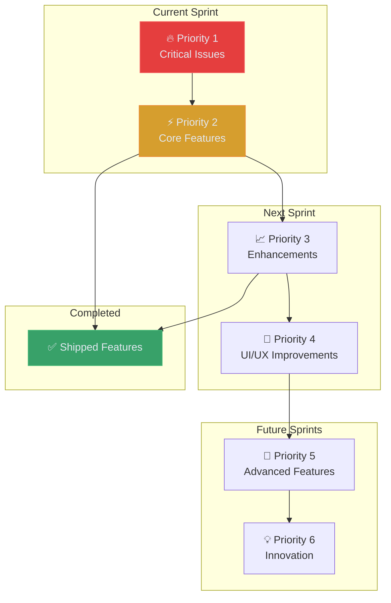

# Product Backlog

> Development priorities and feature backlog for ARCFORGE platform

**Tags:** #backlog #planning #features #priorities

## 🎯 Backlog Overview

ARCFORGE product backlog organized by priority and development phases. This living document tracks feature development from conception to completion.

## 🔥 Priority 1: Critical Issues (Immediate - 1-2 Weeks)

### **Security and Privacy**
- [ ] **🚨 Username System Implementation** *(CRITICAL)*
  - **Issue**: User emails exposed in forum posts
  - **Solution**: Implement display names/usernames
  - **Impact**: Major privacy concern
  - **Effort**: 2-3 days
  - **Dependencies**: Database migration, UI updates

- [ ] **🔒 Enhanced Security Measures**
  - Rate limiting for API endpoints
  - CSRF protection implementation
  - SQL injection prevention audit
  - XSS protection validation

### **Critical Bug Fixes**
- [ ] **🐛 Authentication Modal "J" Key Bug**
  - **Issue**: "j" key not working in input fields
  - **Impact**: Users cannot type emails/passwords with "j"
  - **Priority**: High
  - **Effort**: 1 day

- [ ] **🔄 Logout Redirect Bug**
  - **Issue**: Logout button doesn't redirect to home
  - **Impact**: User experience confusion
  - **Effort**: 0.5 days

- [ ] **🔍 Search System Conflicts**
  - Fix global search vs forum search implementations
  - Repair search highlighting functionality
  - Unify search interfaces

## ⚡ Priority 2: Core Features (2-4 Weeks)

### **Forum Search Enhancement**
- [ ] **Backend Search Endpoints**
  - Full-text search across posts and replies
  - Advanced filtering (category, author, date)
  - Search result ranking algorithm
  - Search analytics tracking

- [ ] **Frontend Search Improvements**
  - Unified search interface
  - Search autocomplete and suggestions
  - Search history and saved searches
  - Performance optimization

### **User Experience Improvements**
- [ ] **Rich Text Editor**
  - Markdown support for posts and replies
  - Live preview functionality
  - Code syntax highlighting
  - Image upload and embedding

- [ ] **Post Management Features**
  - Edit functionality for posts and replies
  - Post deletion with confirmation
  - Post history and revision tracking
  - Content versioning system

### **Mobile Optimization**
- [ ] **Cross-platform Compatibility**
  - Fix Mac keybind compatibility
  - Mobile keyboard shortcut alternatives
  - Touch-friendly navigation improvements
  - Safari/Chrome/Firefox testing

## 📈 Priority 3: Enhancements (4-8 Weeks)

### **Premium Features**
- [ ] **Subscription System**
  - Stripe payment integration
  - Tier-based access control
  - Subscription management UI
  - Billing automation and invoicing

- [ ] **Premium Content System**
  - Content gating for premium categories
  - Preview mode for paywalled content
  - Premium badge display
  - Exclusive content indicators

### **Community Features**
- [ ] **User Profiles**
  - Customizable user profiles
  - Post history and statistics
  - User achievements and badges
  - Profile privacy settings

- [ ] **Reputation System**
  - User karma/reputation scoring
  - Badge and achievement system
  - Community recognition features
  - Reputation-based privileges

### **Advanced Forum Features**
- [ ] **Forum Reactions System** *(High Priority)*
  - Discord-style emoji reactions (👍, 👎, ❤️, 😂, 😮, 😢, 😡)
  - Custom reaction sets for different categories
  - Reaction counts and user lists
  - Quick reaction picker interface
  - Reaction notifications for post authors
  - Analytics for most popular reactions
  - Admin control over available reactions

- [ ] **Custom Emoji System** *(Premium Feature)*
  - User-uploaded custom emojis (like Discord)
  - Tier-based access (Free: standard only, Premium: use custom, Admin: upload custom)
  - Emoji upload interface (PNG/GIF, auto-resize, moderation queue)
  - Custom emoji categories and organization
  - Usage analytics and popularity tracking
  - Bulk emoji management for admins
  - Enterprise custom emoji sets for organizations
  - CDN integration for fast loading

- [ ] **Real-time Notifications**
  - WebSocket integration
  - Live post updates
  - Real-time vote counts
  - Online user indicators

- [ ] **Email Notifications**
  - Reply notifications
  - Mention notifications
  - Weekly digest emails
  - Customizable notification settings

## 🎨 Priority 4: UI/UX Improvements (6-10 Weeks)

### **Terminal Enhancement**
- [ ] **Advanced Terminal Interface**
  - Command history (up arrow)
  - Tab completion for commands
  - Help system (`:help` command)
  - File navigation commands (`cd`, `ls`)

- [ ] **Enhanced Command Palette (Ctrl+K) Features**
  - Advanced fuzzy search across all forum content
  - Smart autocomplete with recent commands
  - Multi-step command workflows (pipe commands)
  - Search filtering by content type (posts, users, categories)
  - Quick action shortcuts (reply, vote, bookmark)
  - Command history with search
  - Custom command aliases and shortcuts
  - AI-powered command suggestions
  - Global search with result previews
  - Dedicated search results page with filtering
  - Search within specific categories/timeframes
  - User search with profile quick-view
  - Bookmark and favorites quick access

### **Visual and Interaction Improvements**
- [ ] **Improved Animations**
  - Smooth folder expand/collapse
  - Loading state animations
  - Hover effects and micro-interactions
  - Page transition effects

- [ ] **Accessibility Enhancements**
  - Screen reader compatibility
  - High contrast mode
  - Keyboard navigation improvements
  - ARIA label optimization

## 🚀 Priority 5: Advanced Features (8-16 Weeks)

### **Content Management**
- [ ] **Advanced Moderation Tools**
  - Report system for inappropriate content
  - User ban and suspension system
  - Content flagging and review
  - Automated spam detection

- [ ] **Image and Media Support**
  - Image uploads for posts
  - Video embedding support
  - File attachment system
  - Media optimization and CDN

### **API and Integration**
- [ ] **RESTful API Expansion**
  - Complete API for mobile apps
  - Third-party integration support
  - API documentation and testing
  - Rate limiting and authentication

- [ ] **Third-party Integrations**
  - GitHub integration for code discussions
  - Discord bot for notifications
  - Slack integration for teams
  - OAuth login providers

### **Performance and Scale**
- [ ] **Performance Optimization**
  - Database indexing and optimization
  - Caching implementation (Redis)
  - CDN integration for static assets
  - Load balancing preparation

## 💡 Priority 6: Innovation (Future)

### **Platform Expansion**
- [ ] **Multi-tenant Architecture**
  - Support for multiple communities
  - Shared infrastructure
  - Tenant isolation and customization
  - Scalable pricing model

- [ ] **AI Integration**
  - Content recommendations
  - Automated moderation
  - Smart notifications
  - Sentiment analysis

### **Advanced Features**
- [ ] **Mobile Applications**
  - React Native mobile app
  - Push notifications
  - Offline functionality
  - App store distribution

- [ ] **Enterprise Features**
  - Single Sign-On (SSO)
  - Custom branding options
  - Advanced analytics
  - White-label solutions

### **Developer Experience Enhancements**
- [ ] **Neovim Navigation System** *(Major Feature)*
  - Complete Neovim modal editing support
  - Visual, insert, and command modes
  - Advanced text manipulation (d, y, p, c operators)
  - Neovim-style search (/pattern, n, N navigation)
  - Buffer management for multiple posts/pages
  - Split view navigation (Ctrl+w commands)
  - Register system for copy/paste operations
  - Macro recording and playback
  - Plugin-like customization system
  - Configuration persistence per user

## ✅ Completed Features

### **Phase 1: Foundation (Q1 2024)**
- [x] **Backend Authentication System** ✅ *COMPLETED*
  - ✅ Express.js server with PostgreSQL
  - ✅ JWT-based authentication
  - ✅ Password hashing with bcrypt
  - ✅ User registration and login APIs

- [x] **Frontend Authentication Integration** ✅ *COMPLETED*
  - ✅ Terminal-style login modal
  - ✅ Session state management
  - ✅ User indicator display
  - ✅ Persistent login sessions

- [x] **Core Forum Platform** ✅ *COMPLETED*
  - ✅ Category-based discussion structure
  - ✅ Post creation and reply system
  - ✅ Threaded reply/comment system
  - ✅ Individual post detail pages

### **Phase 2: MVP Launch (Q2 2024)**
- [x] **Voting System** ✅ *COMPLETED*
  - ✅ Polymorphic voting for posts and replies
  - ✅ Upvote/downvote functionality
  - ✅ Vote counting and display
  - ✅ User vote state persistence

- [x] **Search Implementation** ✅ *COMPLETED*
  - ✅ Vim-style page search (`/` key)
  - ✅ Command palette (Ctrl+K)
  - ✅ Real-time highlighting
  - ✅ Smart keyboard navigation

- [x] **Content Organization** ✅ *COMPLETED*
  - ✅ Reorganized content structure
  - ✅ Category-based navigation
  - ✅ Premium content styling
  - ✅ Updated navigation links

- [x] **Production Deployment** ✅ *COMPLETED*
  - ✅ VPS deployment configuration
  - ✅ nginx reverse proxy setup
  - ✅ SSL/TLS certificate implementation
  - ✅ PM2 process management

## 📊 Backlog Metrics

### **Current Sprint Velocity**
- **Story Points Completed**: 8-12 per week
- **Bug Fix Rate**: 3-5 bugs per week
- **Feature Completion**: 1-2 major features per month
- **Technical Debt**: 20% of sprint capacity

### **Effort Estimation**
- **Small**: 0.5-1 day (Bug fixes, minor UI changes)
- **Medium**: 2-5 days (New features, integrations)
- **Large**: 1-2 weeks (Major features, architecture changes)
- **Epic**: 3-8 weeks (Platform overhauls, new products)

### **Risk Assessment**
- **High Risk**: Security features, payment integration
- **Medium Risk**: Performance optimization, mobile features
- **Low Risk**: UI improvements, content updates
- **Dependencies**: Third-party services, infrastructure changes

## 🔄 Backlog Management

### **Review Process**
- **Weekly Review**: Priority assessment and story grooming
- **Sprint Planning**: Feature selection and effort estimation
- **Retrospective**: Completed work analysis
- **Stakeholder Feedback**: User and business input

### **Prioritization Criteria**
1. **Security and Privacy**: Critical issues first
2. **User Impact**: Features affecting most users
3. **Business Value**: Revenue generation potential
4. **Technical Debt**: Long-term maintainability
5. **User Feedback**: Community requests and suggestions

---

*This product backlog guides ARCFORGE development with clear priorities, effort estimates, and completion tracking for sustainable feature delivery.*