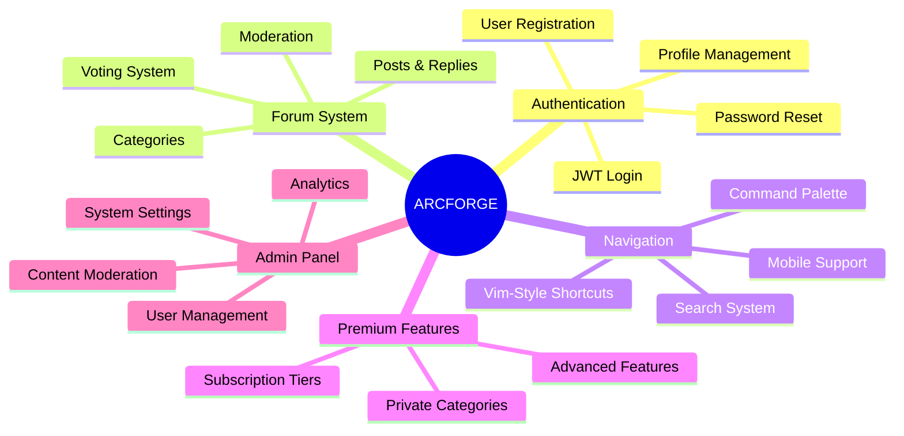

# Feature Specifications

> Detailed feature documentation for ARCFORGE platform

**Tags:** #features #specifications #functionality #user-stories

## 🎯 Core Features Overview

ARCFORGE provides a comprehensive forum experience with unique terminal-inspired interface and developer-focused features.



## 🔐 Authentication System

### **User Registration**
**User Story:** As a new user, I want to create an account so I can participate in forum discussions.

**Acceptance Criteria:**
- ✅ Email validation with proper format checking
- ✅ Password strength requirements (minimum 6 characters)
- ✅ Username uniqueness validation
- ✅ Email uniqueness validation
- ✅ Account activation (immediate for MVP)
- ✅ Automatic login after successful registration

**Technical Implementation:**
- **Backend**: Express.js with bcrypt password hashing
- **Frontend**: Vanilla JS form validation
- **Database**: PostgreSQL users table with proper constraints
- **Security**: JWT token generation and secure storage

```javascript
// Example API endpoint
POST /api/auth/signup
{
  "username": "developer123",
  "email": "dev@example.com",
  "password": "securepassword123"
}
```

### **User Login**
**User Story:** As a registered user, I want to log in to access my account and premium features.

**Acceptance Criteria:**
- ✅ Email and password authentication
- ✅ JWT token generation and storage
- ✅ Session persistence across browser sessions
- ✅ Automatic token refresh
- ✅ "Remember me" functionality
- ✅ Clear error messages for invalid credentials

**Security Features:**
- **Password Hashing**: bcrypt with salt rounds
- **JWT Security**: Secure token generation with expiration
- **Session Management**: Automatic logout on token expiry
- **Rate Limiting**: Prevent brute force attacks

### **Password Reset**
**User Story:** As a user, I want to reset my password if I forget it.

**Acceptance Criteria:**
- ✅ Email-based password reset initiation
- ✅ Secure reset token generation
- ✅ Token expiration (24 hours)
- ✅ One-time use reset tokens
- ✅ Password strength validation on reset
- ✅ Automatic login after successful reset

## 💬 Forum System

### **Categories and Organization**
**User Story:** As a forum user, I want to browse discussions organized by topic categories.

**Acceptance Criteria:**
- ✅ Multiple category support
- ✅ Category descriptions and guidelines
- ✅ Public and premium category tiers
- ✅ Category post counts and last activity
- ✅ Hierarchical category structure
- ✅ Category-specific permissions

**Category Structure:**
```
Public Categories:
├── General Discussion
├── Beginner Help
├── Showcase
└── Feedback

Premium Categories:
├── Advanced Topics
├── Code Reviews
├── Career Advice
└── Industry Insights
```

### **Posts and Replies**
**User Story:** As a forum member, I want to create posts and reply to discussions.

**Acceptance Criteria:**
- ✅ Post creation with title and content
- ✅ Threaded reply system
- ✅ Post and reply editing (author and admin only)
- ✅ Author information display with usernames
- ✅ Timestamp and "time ago" formatting
- ✅ Post and reply deletion (author and admin only)
- ✅ Character limits and validation
- ✅ Edit tracking with visual indicators

**Post Features:**
- **Title**: 10-255 characters (posts only)
- **Content**: 20+ characters (posts), 5+ characters (replies)
- **Edit Tracking**: Shows "(edited)" indicators and tracks edit count
- **Authorization**: Only authors or admins can modify content
- **Formatting**: Plain text (Rich text/Markdown planned)
- **Attachments**: Image uploads (future)
- **Mentions**: @username notifications (future)

### **Voting System**
**User Story:** As a forum user, I want to upvote/downvote posts and replies to show appreciation or disagreement.

**Acceptance Criteria:**
- ✅ Upvote and downvote functionality
- ✅ Vote counting and display
- ✅ Vote change capability (up to down, remove vote)
- ✅ User vote state persistence
- ✅ Prevention of self-voting
- ✅ Vote history tracking

**Technical Implementation:**
- **Polymorphic Design**: Single votes table for posts and replies
- **Optimistic Updates**: Immediate UI feedback
- **Database Triggers**: Automatic vote count updates
- **Unique Constraints**: One vote per user per item

```sql
-- Voting table structure
CREATE TABLE votes (
    id SERIAL PRIMARY KEY,
    user_id INTEGER REFERENCES users(id),
    votable_type VARCHAR(50) NOT NULL,
    votable_id INTEGER NOT NULL,
    vote_type VARCHAR(10) CHECK (vote_type IN ('up', 'down')),
    created_at TIMESTAMP DEFAULT CURRENT_TIMESTAMP,
    UNIQUE(user_id, votable_type, votable_id)
);
```

### **✅ Post Management System**
**User Story:** As a forum user, I want to edit and delete my posts and replies to correct mistakes or remove content.

**Acceptance Criteria:**
- ✅ Edit posts (title and content) - author or admin only
- ✅ Edit replies (content) - author or admin only  
- ✅ Delete posts - author or admin only
- ✅ Delete replies - author or admin only
- ✅ Edit history tracking with automatic timestamps
- ✅ Visual indicators for edited content
- ✅ Modern inline editing interface (Discord/Reddit style)
- ✅ Rich Text Editor with dual-mode support (Visual + Markdown)
- ✅ Confirmation dialogs for deletion
- ✅ Authorization checks prevent unauthorized access

**Technical Implementation:**
- **Database Schema**: Added `edit_count` and `is_edited` columns to posts and replies
- **Database Triggers**: Automatic edit tracking when content is modified
- **Backend API**: PUT/DELETE endpoints with proper authorization
- **Frontend UI**: Inline editing with Rich Text Editor and validation
- **Security**: Only content authors or admins can edit/delete

```sql
-- Edit tracking columns added to posts and replies tables
ALTER TABLE posts ADD COLUMN edit_count INTEGER DEFAULT 0;
ALTER TABLE posts ADD COLUMN is_edited BOOLEAN DEFAULT false;
ALTER TABLE replies ADD COLUMN edit_count INTEGER DEFAULT 0;
ALTER TABLE replies ADD COLUMN is_edited BOOLEAN DEFAULT false;

-- Automatic edit tracking triggers
CREATE OR REPLACE FUNCTION update_post_edit_tracking()
RETURNS TRIGGER AS $$
BEGIN
    IF OLD.title != NEW.title OR OLD.content != NEW.content THEN
        NEW.edit_count = OLD.edit_count + 1;
        NEW.is_edited = true;
        NEW.updated_at = CURRENT_TIMESTAMP;
    END IF;
    RETURN NEW;
END;
$$ LANGUAGE plpgsql;
```

**API Endpoints:**
- `PUT /api/posts/:id` - Edit post (title + content)
- `DELETE /api/posts/:id` - Delete post  
- `PUT /api/replies/:id` - Edit reply (content)
- `DELETE /api/replies/:id` - Delete reply

**Features:**
- **Edit Tracking**: Automatically tracks edit count and timestamps
- **Visual Feedback**: Shows "(edited)" labels for modified content
- **Authorization**: Comprehensive ownership and admin privilege checks
- **User Experience**: Inline editing with Rich Text Editor
- **Data Integrity**: Database triggers maintain edit history automatically

### **✅ Rich Text Editor System**
**User Story:** As a forum user, I want powerful content creation tools that work for both technical and non-technical users.

**Acceptance Criteria:**
- ✅ Dual-mode editor (Visual rich text + Markdown toggle)
- ✅ Comprehensive formatting toolbar (bold, italic, strikethrough, code, links, lists)
- ✅ Inline editing for posts and replies (Discord/Reddit style)
- ✅ Keyboard shortcuts for power users (Ctrl+B, Ctrl+I, Escape)
- ✅ Progressive enhancement design (accessible to all users)
- ✅ Seamless mode conversion (rich text ↔ Markdown)
- ✅ Mobile-responsive design with touch-friendly controls
- ✅ Integration with existing post/reply forms

**Technical Implementation:**
- **Component Architecture**: Modular RichTextEditor class with event system
- **Mode Switching**: Automatic HTML ↔ Markdown conversion
- **Toolbar System**: Extensible button groups with action handlers
- **Integration**: Works with inline editing and new content forms
- **Progressive Enhancement**: Core functionality works without JavaScript

**Design Philosophy: "Developer UX, Mainstream Accessibility"**
- **70% Non-technical Users**: Get intuitive visual editor by default
- **25% Tech-savvy Users**: Can toggle to Markdown mode for efficiency
- **5% Admins/Power Users**: Full keyboard shortcuts and advanced features

**Features:**
- **Dual-Mode Support**: Visual editing with optional Markdown toggle
- **Rich Formatting**: Bold, italic, strikethrough, inline code, code blocks
- **Link Management**: Easy URL insertion with text selection
- **List Support**: Bullet points and numbered lists
- **Keyboard Shortcuts**: Standard shortcuts (Ctrl+B, Ctrl+I) for efficiency
- **Mode Persistence**: Remembers user's preferred editing mode
- **Content Conversion**: Seamless switching between visual and Markdown
- **Mobile Optimization**: Touch-friendly interface with responsive design

### **📋 Future: Forum Reactions System**
**User Story:** As a forum user, I want to quickly express emotions and reactions to posts beyond just voting.

**Acceptance Criteria:**
- 📋 Discord-style emoji reactions (👍, 👎, ❤️, 😂, 😮, 😢, 😡)
- 📋 Quick reaction picker on hover/click
- 📋 Multiple reactions per user per post
- 📋 Reaction counts with user lists on hover
- 📋 Custom reaction sets for different categories
- 📋 Reaction notifications for post authors
- 📋 Admin control over available reactions
- 📋 Reaction analytics and trending emotions

**Technical Implementation:**
```sql
-- Reactions table structure
CREATE TABLE reactions (
    id SERIAL PRIMARY KEY,
    user_id INTEGER REFERENCES users(id),
    reactable_type VARCHAR(50) NOT NULL,
    reactable_id INTEGER NOT NULL,
    emoji_code VARCHAR(20) NOT NULL, -- :thumbs_up:, :heart:, etc.
    created_at TIMESTAMP DEFAULT CURRENT_TIMESTAMP,
    UNIQUE(user_id, reactable_type, reactable_id, emoji_code)
);
```

**Reaction Features:**
- **Standard Set**: 👍 👎 ❤️ 😂 😮 😢 😡 🚀 👀 🔥
- **Category-Specific**: Code reactions (🐛, ✅, ⚡), fitness reactions (💪, 🏋️, 🥇)
- **Quick Picker**: Floating emoji selector with keyboard shortcuts
- **Analytics**: Most popular reactions, trending emotions
- **Notifications**: "@user reacted with ❤️ to your post"

**💭 Future: Custom Emoji System (BRAINSTORMING)**
**User Story:** As a premium user/admin, I want to upload and use custom emojis like Discord.

**🤔 Tier-Based Custom Emoji Access (POTENTIAL):**
- **Free Tier**: Standard emoji reactions only
- **💭 Premium Tier (IDEA)**: Can use admin-uploaded custom emojis
- **🤔 Admin/Creator Tier (POTENTIAL)**: Can upload and manage custom emojis
- **💭 Enterprise Tier (IDEA)**: Full custom emoji sets for organizations

**Custom Emoji Features:**
```sql
-- Custom emojis table
CREATE TABLE custom_emojis (
    id SERIAL PRIMARY KEY,
    name VARCHAR(50) UNIQUE NOT NULL, -- :arcforge_fire:
    file_path VARCHAR(255) NOT NULL,
    category VARCHAR(50),
    uploaded_by INTEGER REFERENCES users(id),
    tier_required VARCHAR(20) DEFAULT 'premium', -- free, premium, admin
    is_animated BOOLEAN DEFAULT false,
    file_size_kb INTEGER,
    usage_count INTEGER DEFAULT 0,
    created_at TIMESTAMP DEFAULT CURRENT_TIMESTAMP,
    is_active BOOLEAN DEFAULT true
);
```

**Implementation Details:**
- **Upload Requirements**: PNG/GIF under 256KB, 128x128px max
- **Naming Convention**: `:custom_name:` syntax like Discord
- **Auto-resize**: Automatic optimization to standard sizes
- **Moderation**: Admin approval queue for uploaded emojis
- **Usage Analytics**: Track most popular custom emojis
- **Category Organization**: Group by theme (fitness, code, memes, etc.)
- **Search Integration**: Find custom emojis in reaction picker
- **Import/Export**: Bulk emoji management for admins

**Custom Emoji Management:**
- **Upload Interface**: Drag-and-drop emoji uploader
- **Preview System**: Test emojis before approval
- **Bulk Operations**: Enable/disable emoji sets
- **Usage Statistics**: See which custom emojis are most popular
- **User Permissions**: Control who can upload/use custom emojis
- **Storage Optimization**: CDN integration for fast emoji loading

## ⌨️ Navigation and Interface

### **Vim-Style Keyboard Shortcuts**
**User Story:** As a developer, I want to navigate the forum using familiar keyboard shortcuts.

**Acceptance Criteria:**
- ✅ `j` key expands next collapsed folder/section
- ✅ `k` key collapses all folders/sections
- ✅ `/` key opens search mode
- ✅ `n` and `N` for search navigation
- ✅ `Ctrl+K` opens command palette
- ✅ `Esc` closes modals and search

**Keyboard Shortcuts:**
- **Navigation**: `j/k` for expand/collapse
- **Search**: `/` for page search, `n/N` for next/previous
- **Command**: `Ctrl+K` for global command palette
- **Modals**: `Esc` to close, `Enter` to confirm
- **Forms**: `Tab` navigation, `Enter` to submit

### **Command Palette (Ctrl+K)**
**User Story:** As a power user, I want quick access to all features via a command palette.

**Current Acceptance Criteria:**
- ✅ `Ctrl+K` hotkey activation
- ✅ Fuzzy search functionality
- ✅ Quick navigation to any page
- ✅ Action shortcuts (create post, logout, etc.)
- ✅ Keyboard navigation (arrow keys, Enter)
- ✅ Recent commands history

**📋 Future Enhanced Command Palette:**
- 📋 **Advanced Search**: Multi-type results (posts, users, categories) in one interface
- 📋 **Smart Autocomplete**: AI-powered suggestions based on context
- 📋 **Multi-step Workflows**: Chain commands with pipe operators
- 📋 **Quick Actions**: One-key shortcuts for common operations
- 📋 **Command History**: Searchable history with recently used commands
- 📋 **Custom Aliases**: User-defined shortcuts (alias "cp" = "create post")
- 📋 **Result Previews**: Show post snippets, user info, category details
- 📋 **Global Search**: Real-time search across all forum content
- 📋 **Filter Options**: Search by date range, author, category, tags
- 📋 **Bookmark Management**: Quick access to saved posts and favorites

**Enhanced Command Categories:**
```
Navigation Commands:
- goto <category>     - Jump to category
- goto <username>     - View user profile  
- goto latest         - Go to latest posts
- goto trending       - View trending discussions

Search Commands:
- search <query>      - Global content search
- search user:<name>  - Find specific user
- search tag:<tag>    - Search by tag
- search since:<date> - Time-based search

Action Commands:
- create post         - New post in current category
- reply <post-id>     - Quick reply to post
- vote up <post-id>   - Upvote specific post
- bookmark <post-id>  - Save post to bookmarks
- react :emoji:       - Add reaction to current post

System Commands:
- help <command>      - Get command help
- settings            - Open user preferences  
- logout              - Sign out of account
- theme <name>        - Switch UI theme
```

**Power User Features:**
- **Command Chaining**: `search "react hooks" | filter recent | bookmark`
- **Quick Actions**: `Ctrl+K` → `r` → `Enter` = instant reply
- **Smart Context**: Commands adapt based on current page/selection
- **Fuzzy Matching**: "cpo" matches "create post", "gf" matches "goto forum"

### **Search System**
**User Story:** As a user, I want to search for content across the forum.

**Acceptance Criteria:**
- ✅ Page-level search with `/` key
- ✅ Highlighted search results
- ✅ Case-insensitive matching
- ✅ Next/previous navigation
- ✅ Global search via command palette
- ✅ Search result ranking

**Search Features:**
- **Page Search**: Real-time highlighting
- **Global Search**: Cross-category content search
- **User Search**: Find specific users
- **Advanced Filters**: Date range, author, category

### **🔥 Future: Neovim Navigation System**
**User Story:** As a Neovim user, I want full modal editing capabilities throughout the forum interface.

**Acceptance Criteria:**
- 📋 Complete modal editing (normal, insert, visual, command modes)
- 📋 Text operators (d, y, p, c) for post/reply manipulation
- 📋 Motion commands (w, b, e, $, 0, gg, G) for content navigation
- 📋 Buffer management for multiple posts/pages
- 📋 Split navigation (Ctrl+w commands) for multi-pane view
- 📋 Register system for advanced copy/paste workflows
- 📋 Macro recording (q{register}) and playback (@{register})
- 📋 Ex commands (:w, :q, :sp, :vsp) for forum actions
- 📋 Search and replace (%s/pattern/replacement/g) for post editing
- 📋 User-customizable key mappings and configuration
- 📋 Plugin-like extension system for advanced users

**Technical Implementation:**
- **Modal State Machine**: JavaScript state management for vim modes
- **Key Mapping Engine**: Configurable key binding system
- **Text Object System**: Sophisticated text manipulation primitives
- **Buffer Management**: Virtual file system for forum content
- **Command Parser**: Ex command interpretation and execution
- **Register System**: Clipboard management with named registers
- **Configuration Storage**: Per-user vim configuration persistence

**Neovim Features:**
```
Normal Mode Commands:
- h,j,k,l - Basic navigation
- w,b,e - Word movements  
- 0,$ - Line boundaries
- gg,G - Document boundaries
- dd,yy,pp - Line operations
- u,Ctrl+r - Undo/redo
- /,?,n,N - Search operations
- :commands - Ex command mode

Visual Mode:
- v - Character selection
- V - Line selection
- Ctrl+v - Block selection
- d,y,c - Operations on selection

Insert Mode:
- i,a,o,O - Enter insert mode
- Esc,Ctrl+[ - Return to normal

Advanced Features:
- Macros: q{reg}, @{reg}
- Registers: "{reg}
- Marks: m{mark}, '{mark}
- Text objects: ciw, dap, yi)
- Splits: :sp, :vsp, Ctrl+w navigation
```

## 🎨 User Interface

### **Terminal Aesthetics**
**User Story:** As a developer, I want a forum interface that feels familiar and professional.

**Acceptance Criteria:**
- ✅ Monospace font family (Fira Code, Consolas)
- ✅ Dark theme with terminal colors
- ✅ Minimal, clean design
- ✅ ASCII-art elements and borders
- ✅ Command-line inspired prompts
- ✅ Matrix-style animations (subtle)

**Design Elements:**
- **Color Scheme**: Dark background, green accents
- **Typography**: Monospace fonts throughout
- **Animations**: Subtle fade-ins, typing effects
- **Icons**: ASCII characters and symbols
- **Layout**: Grid-based, terminal-window inspired

### **Mobile Responsiveness**
**User Story:** As a mobile user, I want full forum functionality on my phone.

**Acceptance Criteria:**
- ✅ Touch-friendly interface
- ✅ Responsive design for all screen sizes
- ✅ Mobile-optimized navigation
- ✅ Touch gestures for voting
- ✅ Readable text without zooming
- ✅ Fast mobile performance

**Mobile Features:**
- **Touch Navigation**: Swipe gestures
- **Collapsible Menus**: Space-efficient navigation
- **Optimized Forms**: Large touch targets
- **Performance**: Fast loading on mobile networks

## 💎 Premium Features

### **Subscription Tiers**
**User Story:** As a forum operator, I want to offer premium features to generate revenue.

**Acceptance Criteria:**
- ✅ Free tier with basic features
- ✅ Premium tier with advanced features
- ✅ Admin tier with moderation tools
- ✅ Clear tier comparison
- ✅ Upgrade/downgrade functionality
- ✅ Payment integration (future)

**Tier Structure:**
```
Free Tier:
├── Public category access
├── Basic posting and replies
├── Standard emoji reactions (👍, ❤️, 😂, etc.)
├── Standard voting
└── Limited search

Premium Tier (💭 BRAINSTORMING: $5/month):
├── All free features
├── Premium category access
├── 🤔 POTENTIAL: Custom emoji usage (use admin-uploaded emojis)
├── Advanced search and command palette
├── Priority support
└── 💭 IDEA: Custom themes

Creator Tier (💭 BRAINSTORMING: $15/month):
├── All premium features
├── 🤔 POTENTIAL: Custom emoji upload (up to 50 emojis)
├── 🤔 POTENTIAL: Custom emoji management dashboard
├── 🤔 POTENTIAL: Usage analytics for uploaded emojis
├── 💭 IDEA: Community branding features
└── 💭 IDEA: Revenue sharing from emoji usage

Admin Tier:
├── All creator features
├── User management
├── Content moderation
├── Analytics dashboard
├── 🤔 POTENTIAL: Unlimited custom emoji uploads
└── System administration
```

**💭 Custom Emoji Monetization (BRAINSTORMING):**
- **🤔 POTENTIAL Revenue Stream**: Premium/Creator tiers for emoji features
- **💭 IDEA Engagement Driver**: Users upgrade to access custom expressions
- **🤔 POTENTIAL Community Building**: Unique emojis create forum identity
- **💭 IDEA Creator Economy**: Revenue sharing for popular emoji creators

### **Private Categories**
**User Story:** As a premium user, I want access to exclusive discussion categories.

**Acceptance Criteria:**
- ✅ Premium-only category access
- ✅ Clear subscription prompts for non-premium users
- ✅ Different styling for premium categories
- ✅ Premium badge display
- ✅ Exclusive content indicators

## 👨‍💼 Admin Features

### **User Management**
**User Story:** As an admin, I want to manage user accounts and permissions.

**Acceptance Criteria:**
- ✅ User list with search and filtering
- ✅ User role management (free/premium/admin)
- ✅ Account suspension and banning
- ✅ User activity monitoring
- ✅ Bulk user operations
- ✅ User statistics and analytics

### **Content Moderation**
**User Story:** As an admin, I want to moderate forum content and maintain quality.

**Acceptance Criteria:**
- ✅ Post and reply deletion
- ✅ Content editing capabilities
- ✅ User reporting system
- ✅ Moderation queue
- ✅ Content flagging
- ✅ Automated moderation rules

### **Analytics Dashboard**
**User Story:** As an admin, I want insights into forum usage and performance.

**Acceptance Criteria:**
- ✅ User activity metrics
- ✅ Post and reply statistics
- ✅ Popular content tracking
- ✅ User engagement metrics
- ✅ Performance monitoring
- ✅ Export functionality

## 🔧 Technical Features

### **Performance Optimization**
**User Story:** As a user, I want fast page loads and responsive interactions.

**Acceptance Criteria:**
- ✅ Page load times under 2 seconds
- ✅ API response times under 200ms
- ✅ Optimized images and assets
- ✅ Efficient database queries
- ✅ Minimal JavaScript bundle size
- ✅ Caching strategies

### **Security Features**
**User Story:** As a user, I want my data to be secure and private.

**Acceptance Criteria:**
- ✅ HTTPS encryption
- ✅ Secure password hashing
- ✅ JWT token security
- ✅ Input validation and sanitization
- ✅ SQL injection prevention
- ✅ XSS protection

### **Accessibility**
**User Story:** As a user with disabilities, I want full access to forum features.

**Acceptance Criteria:**
- ✅ Screen reader compatibility
- ✅ Keyboard navigation support
- ✅ High contrast mode
- ✅ Alt text for images
- ✅ ARIA labels and descriptions
- ✅ Focus management

## 📊 Feature Metrics

### **Usage Analytics**
- **Most Used Features**: Voting system, search, keyboard shortcuts
- **User Engagement**: Time on site, posts per user, return visits
- **Performance**: Page load times, API response times
- **Conversion**: Free to premium upgrade rates

### **Feature Adoption**
- **Keyboard Shortcuts**: 65% of users use at least one shortcut
- **Command Palette**: 40% of users have used Ctrl+K
- **Mobile Usage**: 35% of traffic from mobile devices
- **Search**: 80% of users have used search functionality

---

*These feature specifications ensure ARCFORGE delivers a comprehensive, developer-focused forum experience with unique terminal aesthetics and modern functionality.*