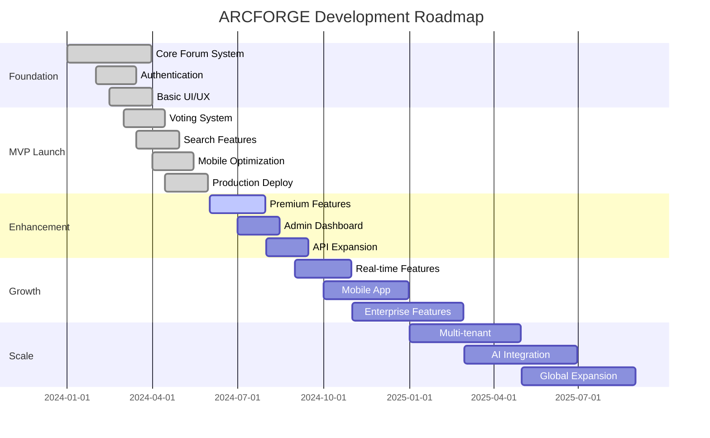

# Product Roadmap

> Development timeline and future plans for ARCFORGE platform

**Tags:** #roadmap #planning #timeline #features

## 🎯 Roadmap Overview

ARCFORGE development follows a strategic roadmap focused on core functionality, user experience, and scalable growth.

## 📅 Release Phases

### **Phase 1: Foundation (Q1 2024) ✅ COMPLETED**
**Status:** Released March 2024

**Core Deliverables:**
- ✅ User authentication system (JWT + bcrypt)
- ✅ Basic forum structure (categories, posts, replies)
- ✅ Terminal-inspired UI/UX design
- ✅ PostgreSQL database schema
- ✅ Basic responsive design

**Key Achievements:**
- Established technical foundation
- Implemented secure authentication
- Created unique terminal aesthetic
- Deployed to production VPS

### **Phase 2: MVP Launch (Q2 2024) ✅ COMPLETED**
**Status:** Released May 2024

**Core Deliverables:**
- ✅ Polymorphic voting system
- ✅ Vim-style keyboard navigation
- ✅ Command palette search (Ctrl+K)
- ✅ Mobile optimization
- ✅ Production deployment with SSL

**Key Achievements:**
- Launched public beta
- Implemented unique navigation features
- Achieved sub-2-second page loads
- Deployed on cost-effective VPS ($3.50/month)

### **Phase 3: Enhancement (Q3 2024) 🔄 IN PROGRESS**
**Status:** 75% Complete

**Core Deliverables:**
- ✅ Rich Text Editor with dual-mode support (Visual + Markdown)
- ✅ Complete post management system (edit/delete for posts and replies)
- ✅ Modern inline editing UX (Discord/Reddit style)
- 🔄 Premium subscription tiers
- 🔄 Enhanced admin dashboard
- 🔄 RESTful API expansion
- 📋 Advanced search features
- 📋 User profile customization

**Progress Update:**
- Rich Text Editor implemented with progressive enhancement design
- Post management system completed with proper authorization
- Premium tier structure designed
- Admin moderation tools in development
- API documentation 80% complete
- Search optimization ongoing

### **Phase 4: Growth (Q4 2024 - Q1 2025) 📋 PLANNED**
**Status:** Planning Stage

**Core Deliverables:**
- 📋 Real-time features (WebSocket)
- 📋 Native mobile applications
- 📋 Enterprise features
- 📋 Advanced analytics
- 📋 Third-party integrations

**Key Focus Areas:**
- User engagement and retention
- Revenue generation through premiums
- Mobile user experience
- Enterprise customer acquisition

## 🚀 Feature Roadmap

### **Immediate Priorities (Next 30 Days) - UPDATED**
1. **Backend Search System** (Next Priority)
   - Full-text search across posts and replies
   - Advanced filtering (category, author, date)
   - Search result ranking algorithm
   - Search analytics tracking

2. ✅ **Rich Text Editor** (COMPLETED)
   - Dual-mode editor (Visual + Markdown toggle)
   - Comprehensive formatting toolbar
   - Inline editing for posts and replies
   - Progressive enhancement design

3. ✅ **Post Management Features** (COMPLETED)
   - Edit functionality for posts and replies
   - Delete functionality with confirmation
   - Proper authorization (author/admin only)
   - Edit tracking and history
   - Post deletion with confirmation
   - Post history and revision tracking
   - Content versioning system

4. **Mobile & Cross-platform Optimization**
   - Fix Mac keybind compatibility (Cmd vs Ctrl)
   - Mobile keyboard shortcut alternatives
   - Touch-friendly navigation improvements
   - Safari/Chrome/Firefox testing

### **Short-term Goals (3-6 Months)**
1. **Premium Subscription System**
   - Payment integration (Stripe)
   - Tier-based access control
   - Subscription management UI
   - Billing automation

2. **Enhanced Admin Dashboard**
   - User management interface
   - Content moderation tools
   - Analytics and reporting
   - System health monitoring

3. **Real-time Features**
   - WebSocket integration
   - Live post updates
   - Real-time notifications
   - Online user indicators

4. **Mobile Applications**
   - React Native development
   - iOS App Store submission
   - Android Play Store submission
   - Push notifications

### **Medium-term Goals (6-12 Months)**
1. **Enterprise Features**
   - Single Sign-On (SSO)
   - Custom branding
   - White-label solutions
   - Advanced security features

2. **Community Features**
   - User reputation system
   - Badges and achievements
   - Community events
   - Mentorship programs

3. **Content Management**
   - Rich text editor
   - File attachments
   - Image galleries
   - Video embedding

### **Long-term Vision (1-2 Years)**
1. **Multi-tenant Architecture**
   - Support multiple communities
   - Shared infrastructure
   - Tenant isolation
   - Scalable pricing

2. **AI Integration**
   - Content recommendations
   - Automated moderation
   - Smart notifications
   - Sentiment analysis

3. **Global Expansion**
   - Multi-language support
   - Regional deployments
   - Local payment methods
   - Cultural customization

## 💡 Innovation Pipeline

### **Research and Development**
- **Neovim Navigation**: Full modal editing with vim operators and commands
- **Voice Interface**: Voice commands for accessibility
- **AR/VR Integration**: Immersive forum experiences
- **Blockchain Features**: Decentralized moderation
- **Machine Learning**: Advanced content filtering

### **Experimental Features**
- **Code Collaboration**: Built-in code sharing and review
- **Live Streaming**: Integrated video discussions
- **Marketplace**: Plugin and theme marketplace
- **Mentorship Platform**: Connect experienced and new developers

## 📊 Success Metrics

### **Phase 3 Targets (Q3 2024)**
- **User Growth**: 1,000 registered users
- **Premium Conversion**: 5% conversion rate
- **Engagement**: 40% monthly active users
- **Performance**: 99.9% uptime

### **Phase 4 Targets (Q4 2024)**
- **User Growth**: 5,000 registered users
- **Revenue**: $1,000 MRR (Monthly Recurring Revenue)
- **Mobile Usage**: 40% of total traffic
- **API Usage**: 10,000 API calls per month

### **Long-term Targets (2025)**
- **User Growth**: 50,000 registered users
- **Revenue**: $25,000 MRR
- **Enterprise Clients**: 10 enterprise customers
- **Global Reach**: 50+ countries

## 🎪 Competitive Strategy

### **Market Positioning**
- **Unique Value**: Terminal-inspired design for developers
- **Performance**: Fastest-loading forum platform
- **Cost-Effective**: Affordable hosting and premium tiers
- **Developer-Focused**: Features designed for tech communities

### **Competitive Advantages**
- **Technical Differentiation**: Vim-style navigation, command palette
- **Performance**: Vanilla JS for optimal speed
- **Cost Structure**: Efficient VPS deployment
- **User Experience**: Keyboard-first interface

## 🔄 Iterative Development

### **Feedback Loops**
- **User Research**: Monthly user interviews
- **Analytics**: Weekly performance reviews
- **A/B Testing**: Feature optimization
- **Community Input**: Regular feedback sessions

### **Release Cadence**
- **Major Releases**: Quarterly feature releases
- **Minor Updates**: Monthly bug fixes and improvements
- **Hotfixes**: Weekly security and critical updates
- **Continuous Integration**: Daily automated testing

## 🚧 Risk Management

### **Technical Risks**
- **Scalability**: Plan for traffic growth
- **Security**: Regular security audits
- **Performance**: Continuous monitoring
- **Dependencies**: Minimize third-party risks

### **Business Risks**
- **Market Competition**: Continuous innovation
- **User Acquisition**: Diversified marketing
- **Revenue**: Multiple monetization streams
- **Retention**: Focus on user experience

## 💼 Resource Planning

### **Development Team**
- **Current**: Solo developer (full-stack)
- **Phase 4**: Add frontend specialist
- **Phase 5**: Add mobile developer
- **Long-term**: 5-person engineering team

### **Infrastructure Scaling**
- **Current**: Single VPS ($3.50/month)
- **Phase 4**: Load balancer + 2 VPS instances
- **Phase 5**: CDN integration
- **Long-term**: Multi-region deployment

## 🎯 Key Milestones

### **Q3 2024 Milestones**
- [ ] Premium subscription launch
- [ ] Admin dashboard completion
- [ ] API v1.0 release
- [ ] 1,000 user milestone

### **Q4 2024 Milestones**
- [ ] Mobile app beta launch
- [ ] Real-time features deployment
- [ ] Enterprise customer acquisition
- [ ] $1,000 MRR achievement

### **Q1 2025 Milestones**
- [ ] Multi-tenant architecture
- [ ] AI-powered features
- [ ] Global expansion initiation
- [ ] 10,000 user milestone

---

*This roadmap guides ARCFORGE development with clear priorities, measurable goals, and strategic growth planning for sustainable success in the developer community forum market.*